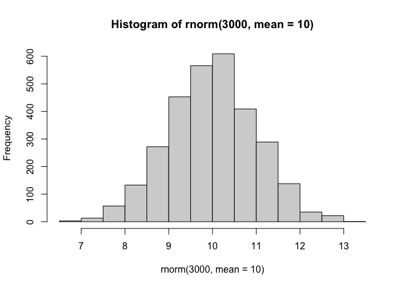
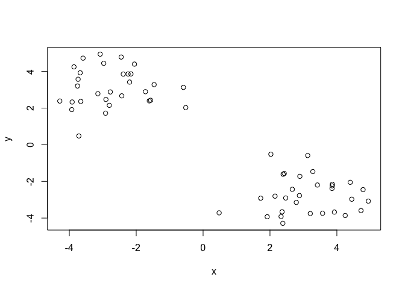
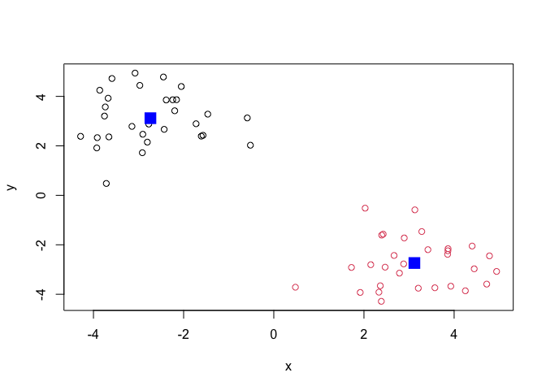
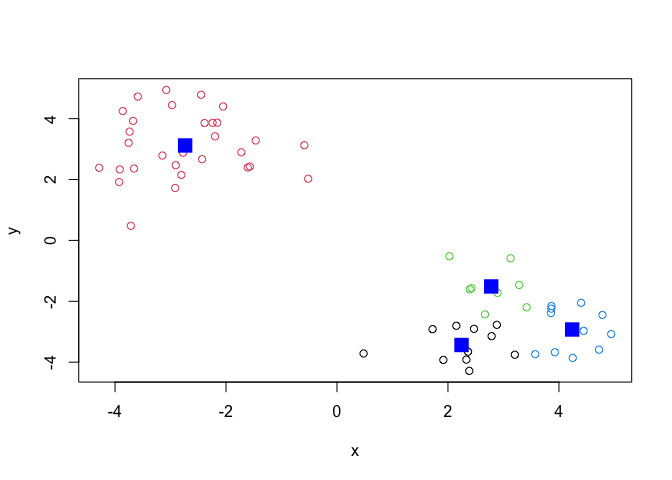
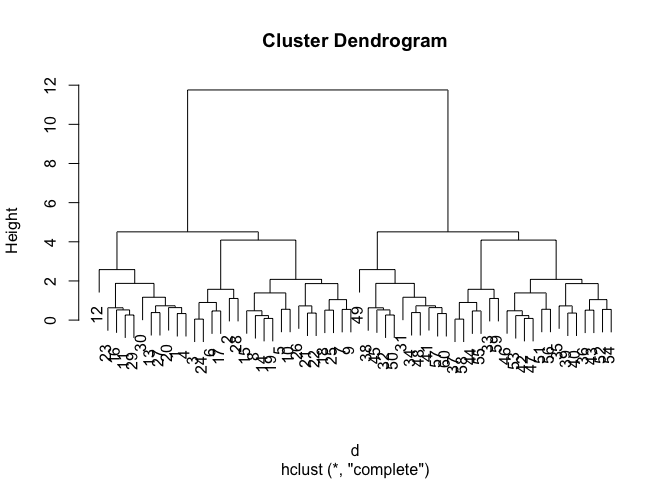
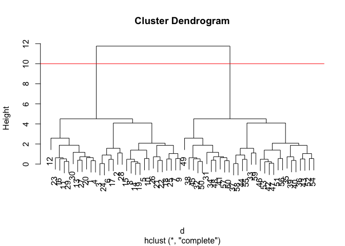
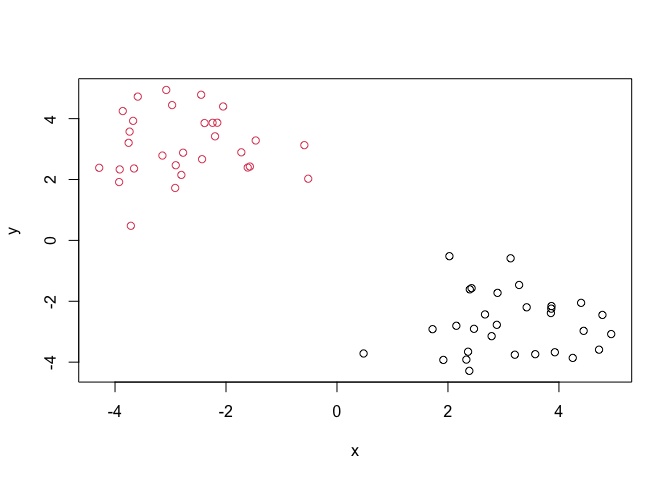
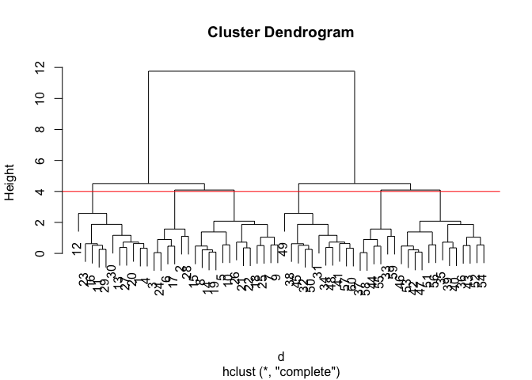
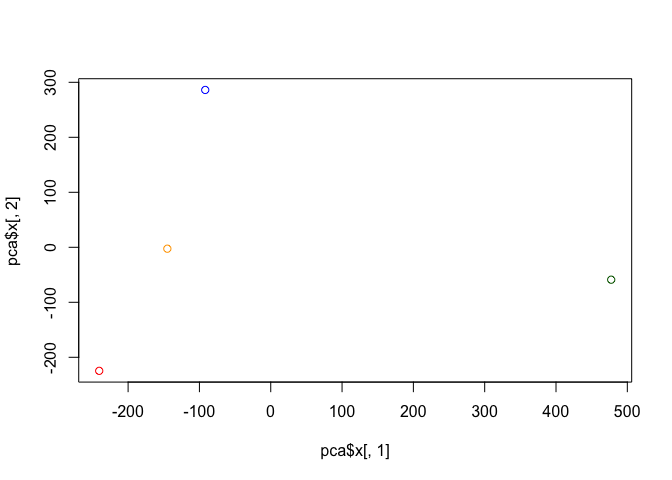
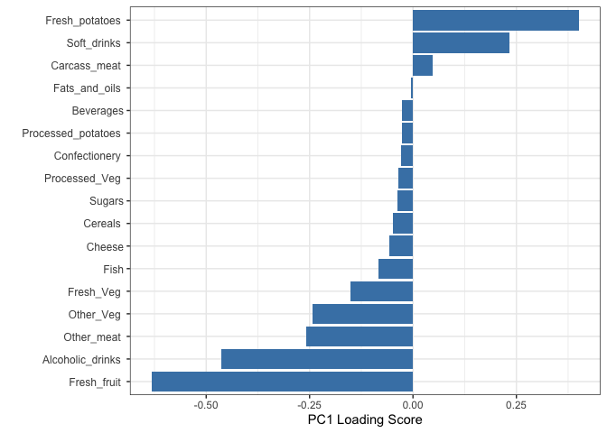

# Class 7 Machine Learning
Kaliyah Adeimanu A18125684

## Background

Today we will begin our exploration of important machine learning
methods with a focus on **clustering** and **dimensionality reduction**

To start testing these methods let’s make up some smaple data to cluster
where we know what the answer should be.

``` r
hist(rnorm(3000, mean=10))
```



> Q. Can you generate 30 numbers centered at +3 and 30 numbers at -3
> taken at random from a normal distribution?

``` r
tmp <- c(rnorm(n=30,mean=3),
         rnorm(n=30, mean=-3))

x <- cbind(x=tmp,y=rev(tmp))
plot(x)
```



## K-means clustering

The main funtion in “base R” for K-means clustering is called
`kmeans()`, let’s try it out:

``` r
k <- kmeans(x=x, centers=2)
k
```

    K-means clustering with 2 clusters of sizes 30, 30

    Cluster means:
              x         y
    1 -2.736672  3.118408
    2  3.118408 -2.736672

    Clustering vector:
     [1] 2 2 2 2 2 2 2 2 2 2 2 2 2 2 2 2 2 2 2 2 2 2 2 2 2 2 2 2 2 2 1 1 1 1 1 1 1 1
    [39] 1 1 1 1 1 1 1 1 1 1 1 1 1 1 1 1 1 1 1 1 1 1

    Within cluster sum of squares by cluster:
    [1] 60.8292 60.8292
     (between_SS / total_SS =  89.4 %)

    Available components:

    [1] "cluster"      "centers"      "totss"        "withinss"     "tot.withinss"
    [6] "betweenss"    "size"         "iter"         "ifault"      

> Q. What component of your kmeans result object has the cluster
> centers?

``` r
k$centers
```

              x         y
    1 -2.736672  3.118408
    2  3.118408 -2.736672

> Q. What component of your kmeans result object has the cluster size
> (i.e.how many points are in each cluster)?

``` r
k$size
```

    [1] 30 30

> Q. What component of your kmeans result object has the cluster
> membership vector (i.e. the main clustering result: which points are
> in which cluster)?

``` r
k$cluster
```

     [1] 2 2 2 2 2 2 2 2 2 2 2 2 2 2 2 2 2 2 2 2 2 2 2 2 2 2 2 2 2 2 1 1 1 1 1 1 1 1
    [39] 1 1 1 1 1 1 1 1 1 1 1 1 1 1 1 1 1 1 1 1 1 1

> Q. Plot the results of clcustering (i.e. our data colored by the
> clustering result) along with the cluster centers.

``` r
plot(x, col=k$cluster)
points(k$centers, col= "blue", pch=15, cex=2)
```



> Q. Can you run kmeans again and cluster into 4 clusters and plot the
> results just liek you did above with the coloring by cluster and the
> cluster cneters shown in blue

``` r
k2 <- kmeans(x=x, centers=4)
k2
```

    K-means clustering with 4 clusters of sizes 11, 30, 8, 11

    Cluster means:
              x         y
    1  2.244583 -3.436383
    2 -2.736672  3.118408
    3  2.779587 -1.512860
    4  4.238650 -2.927007

    Clustering vector:
     [1] 1 3 3 1 4 3 4 4 4 4 1 1 1 4 3 1 3 4 4 3 4 4 1 3 4 1 1 3 1 1 2 2 2 2 2 2 2 2
    [39] 2 2 2 2 2 2 2 2 2 2 2 2 2 2 2 2 2 2 2 2 2 2

    Within cluster sum of squares by cluster:
    [1]  8.111504 60.829197  4.866775  6.963097
     (between_SS / total_SS =  93.0 %)

    Available components:

    [1] "cluster"      "centers"      "totss"        "withinss"     "tot.withinss"
    [6] "betweenss"    "size"         "iter"         "ifault"      

``` r
k2$size
```

    [1] 11 30  8 11

``` r
plot(x,col=k2$cluster)
points(k2$centers, col="blue", pch=15, cex=2)
```



> **Key-point:** Kmeans will always return the clustering that we ask
> for (this is the “K” or “centers” in K-means)

``` r
k$tot.withinss
```

    [1] 121.6584

## Hierarchial clustering

The main function for hierarchical clustering in base R is called
`hclust()`. One of the main differences with respect to the `kmeans()`
function is that you can not just pass your input data directly to
`hclust()` - it needs a “distance matrix” as input. We can get this from
lots of places including the `dist()` function.

``` r
d <- dist(x)
hc<- hclust(d)
plot(hc)
```



We can “cut” the dendrogram or “tree” at a given height to yield our
“clusters”. For thsi we use the function `cutree()`

``` r
plot(hc)
abline(h=10, col= "red")
```



``` r
grps <- cutree(hc, h=10)
```

``` r
grps
```

     [1] 1 1 1 1 1 1 1 1 1 1 1 1 1 1 1 1 1 1 1 1 1 1 1 1 1 1 1 1 1 1 2 2 2 2 2 2 2 2
    [39] 2 2 2 2 2 2 2 2 2 2 2 2 2 2 2 2 2 2 2 2 2 2

> Q. Plot out data `x` colored by the clustering result from `hclust()`
> and `cutree()`

``` r
 plot(x, col=grps)
```



``` r
plot(hc)
abline(h=4, col= "red")
```



``` r
grps <- cutree(hc, h=4)
```

## Principal Component Analysis (PCA)

PCA is a popular dimmensionality reduction technique that is widely used
in bioinformatics.

## PCA of UK food consumption

Read data on food consumption in UK

``` r
url <- "https://tinyurl.com/UK-foods"
x <- read.csv(url)
x
```

                         X England Wales Scotland N.Ireland
    1               Cheese     105   103      103        66
    2        Carcass_meat      245   227      242       267
    3          Other_meat      685   803      750       586
    4                 Fish     147   160      122        93
    5       Fats_and_oils      193   235      184       209
    6               Sugars     156   175      147       139
    7      Fresh_potatoes      720   874      566      1033
    8           Fresh_Veg      253   265      171       143
    9           Other_Veg      488   570      418       355
    10 Processed_potatoes      198   203      220       187
    11      Processed_Veg      360   365      337       334
    12        Fresh_fruit     1102  1137      957       674
    13            Cereals     1472  1582     1462      1494
    14           Beverages      57    73       53        47
    15        Soft_drinks     1374  1256     1572      1506
    16   Alcoholic_drinks      375   475      458       135
    17      Confectionery       54    64       62        41

It looks like the row names are not set properly. We can fix this

``` r
rownames(x) <- x[,1]
x <- x[,-1]
x
```

                        England Wales Scotland N.Ireland
    Cheese                  105   103      103        66
    Carcass_meat            245   227      242       267
    Other_meat              685   803      750       586
    Fish                    147   160      122        93
    Fats_and_oils           193   235      184       209
    Sugars                  156   175      147       139
    Fresh_potatoes          720   874      566      1033
    Fresh_Veg               253   265      171       143
    Other_Veg               488   570      418       355
    Processed_potatoes      198   203      220       187
    Processed_Veg           360   365      337       334
    Fresh_fruit            1102  1137      957       674
    Cereals                1472  1582     1462      1494
    Beverages                57    73       53        47
    Soft_drinks            1374  1256     1572      1506
    Alcoholic_drinks        375   475      458       135
    Confectionery            54    64       62        41

A better way to do this is fix the row names assignment at import time:

``` r
x <- read.csv(url, row.names =1)
x
```

                        England Wales Scotland N.Ireland
    Cheese                  105   103      103        66
    Carcass_meat            245   227      242       267
    Other_meat              685   803      750       586
    Fish                    147   160      122        93
    Fats_and_oils           193   235      184       209
    Sugars                  156   175      147       139
    Fresh_potatoes          720   874      566      1033
    Fresh_Veg               253   265      171       143
    Other_Veg               488   570      418       355
    Processed_potatoes      198   203      220       187
    Processed_Veg           360   365      337       334
    Fresh_fruit            1102  1137      957       674
    Cereals                1472  1582     1462      1494
    Beverages                57    73       53        47
    Soft_drinks            1374  1256     1572      1506
    Alcoholic_drinks        375   475      458       135
    Confectionery            54    64       62        41

> Q1. How many rows and columns are in your new data frame named x? What
> R functions could you use to answer this questions?

``` r
dim(x)
```

    [1] 17  4

17 rows and 4 columns

> Q2. Which approach to solving the ‘row-names problem’ mentioned above
> do you prefer and why? Is one approach more robust than another under
> certain circumstances?

``` r
x <- x[,-1]
x
```

                        Wales Scotland N.Ireland
    Cheese                103      103        66
    Carcass_meat          227      242       267
    Other_meat            803      750       586
    Fish                  160      122        93
    Fats_and_oils         235      184       209
    Sugars                175      147       139
    Fresh_potatoes        874      566      1033
    Fresh_Veg             265      171       143
    Other_Veg             570      418       355
    Processed_potatoes    203      220       187
    Processed_Veg         365      337       334
    Fresh_fruit          1137      957       674
    Cereals              1582     1462      1494
    Beverages              73       53        47
    Soft_drinks          1256     1572      1506
    Alcoholic_drinks      475      458       135
    Confectionery          64       62        41

There is an error is you keep running it that says there is an incorrect
number of dimensions because it keeps deleting columns.

> Q3. Changing what optional argument in the above barplot() function
> results in the following plot?

``` r
x <- read.csv(url, row.names =1)
barplot(as.matrix(x), beside=FALSE, col=rainbow(nrow(x)))
```


> Q5. We can use the pairs() function to generate all pairwise plots for
> our countries. Can you make sense of the following code and resulting
> figure? What does it mean if a given point lies on the diagonal for a
> given plot?

``` r
pairs(x, col=rainbow(nrow(x)), pch=16)
```


The code shows each country plotted against each other. This allows us
to see what countries are similar and which are not. We however do not
know what food is what dot. The code makes these pair plots that compare
2 countries at a time, and have colored the foods rainbow.

> Q6. Based on the pairs and heatmap figures, which countries cluster
> together and what does this suggest about their food consumption
> patterns? Can you easily tell what the main differences between N.
> Ireland and the other countries of the UK in terms of this data-set?

``` r
library(pheatmap)
pheatmap( as.matrix(x))
```


The pairs figure shows that England, Wales, and Scotland all have
similar food consumption, there is relatively a straight line when all
of these countries are compared to each other. However that is not the
cas for Northern Ireland. Northern Ireland is not as similar to the rest
of the countries. The `pairs()` plot was the only plot that was useful
for interpretation.

## PCA to the rescue

The main function in ” base R” for PCA is called `prcomp()`.

``` r
pca <- prcomp(t(x))
summary(pca)
```

    Importance of components:
                                PC1      PC2      PC3       PC4
    Standard deviation     324.1502 212.7478 73.87622 3.176e-14
    Proportion of Variance   0.6744   0.2905  0.03503 0.000e+00
    Cumulative Proportion    0.6744   0.9650  1.00000 1.000e+00

> Q. How much variance is captured in the first PC?

67.44%

> Q. How many PCs do I need to capture at least 90% of the total
> variance in the dataset

2, using PC1 and PC2 together captures 96.5% of the total variance.

> Q. Plot our main PCA result. Folks can call this different things
> depending on their field of study e.g. “PC plot”, “ordienation plot”,
> “Score plot”, “PC1 vs PC2 plot”…

``` r
 attributes (pca)
```

    $names
    [1] "sdev"     "rotation" "center"   "scale"    "x"       

    $class
    [1] "prcomp"

To generate our PCA score plot we want the `pca$x` component of the
result object

``` r
pca$x
```

                     PC1         PC2        PC3           PC4
    England   -144.99315   -2.532999 105.768945 -4.894696e-14
    Wales     -240.52915 -224.646925 -56.475555  5.700024e-13
    Scotland   -91.86934  286.081786 -44.415495 -7.460785e-13
    N.Ireland  477.39164  -58.901862  -4.877895  2.321303e-13

``` r
my_cols <- c("orange","red", "blue", "darkgreen")
plot(pca$x[,1], pca$x[,2], col=my_cols)
```



``` r
library(ggplot2)
ggplot(pca$x) + aes(PC1, PC2)+
  geom_point(col= my_cols)
```


## Digging deeper (variable loadings)

How do the original variables (i.e. te 17 different foods) contribute to
our new PCs?

``` r
ggplot(pca$rotation) +
  aes(x = PC1, 
      y = reorder(rownames(pca$rotation), PC1)) +
  geom_col(fill = "steelblue") +
  xlab("PC1 Loading Score") +
  ylab("") +
  theme_bw() +
  theme(axis.text.y = element_text(size = 9))
```



This plot shows how Ireland differs from England, Wales, and Scotland.
In the above figure we can see that England, Wales and Scotland consume
more of fresh fruit, alcoholic drinks etc., while Ireland consumes more
potatoes and soft dirnks than the other 3 countries.
