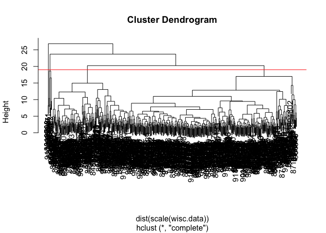
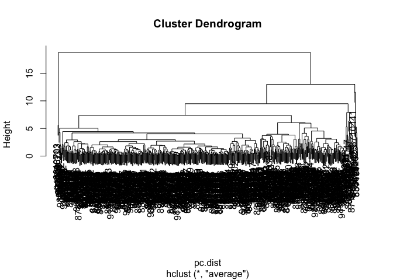

# Class08
Kaliyah Adei-Manu

# Background

In today’s class we will apply the emthods and techniques clustering and
PCA to help make sense of real world breast cancer FNA biopsy data set

## Data import

We will start by importikng our data. It is a CSV file so we will use
the `read.csv()` function.

``` r
fna.data <- "https://bioboot.github.io/bimm143_S20/class-material/WisconsinCancer.csv"

wisc.df <- read.csv(fna.data, row.name=1)
```

We will have a look at the first few rows

``` r
head(wisc.df)
```

             diagnosis radius_mean texture_mean perimeter_mean area_mean
    842302           M       17.99        10.38         122.80    1001.0
    842517           M       20.57        17.77         132.90    1326.0
    84300903         M       19.69        21.25         130.00    1203.0
    84348301         M       11.42        20.38          77.58     386.1
    84358402         M       20.29        14.34         135.10    1297.0
    843786           M       12.45        15.70          82.57     477.1
             smoothness_mean compactness_mean concavity_mean concave.points_mean
    842302           0.11840          0.27760         0.3001             0.14710
    842517           0.08474          0.07864         0.0869             0.07017
    84300903         0.10960          0.15990         0.1974             0.12790
    84348301         0.14250          0.28390         0.2414             0.10520
    84358402         0.10030          0.13280         0.1980             0.10430
    843786           0.12780          0.17000         0.1578             0.08089
             symmetry_mean fractal_dimension_mean radius_se texture_se perimeter_se
    842302          0.2419                0.07871    1.0950     0.9053        8.589
    842517          0.1812                0.05667    0.5435     0.7339        3.398
    84300903        0.2069                0.05999    0.7456     0.7869        4.585
    84348301        0.2597                0.09744    0.4956     1.1560        3.445
    84358402        0.1809                0.05883    0.7572     0.7813        5.438
    843786          0.2087                0.07613    0.3345     0.8902        2.217
             area_se smoothness_se compactness_se concavity_se concave.points_se
    842302    153.40      0.006399        0.04904      0.05373           0.01587
    842517     74.08      0.005225        0.01308      0.01860           0.01340
    84300903   94.03      0.006150        0.04006      0.03832           0.02058
    84348301   27.23      0.009110        0.07458      0.05661           0.01867
    84358402   94.44      0.011490        0.02461      0.05688           0.01885
    843786     27.19      0.007510        0.03345      0.03672           0.01137
             symmetry_se fractal_dimension_se radius_worst texture_worst
    842302       0.03003             0.006193        25.38         17.33
    842517       0.01389             0.003532        24.99         23.41
    84300903     0.02250             0.004571        23.57         25.53
    84348301     0.05963             0.009208        14.91         26.50
    84358402     0.01756             0.005115        22.54         16.67
    843786       0.02165             0.005082        15.47         23.75
             perimeter_worst area_worst smoothness_worst compactness_worst
    842302            184.60     2019.0           0.1622            0.6656
    842517            158.80     1956.0           0.1238            0.1866
    84300903          152.50     1709.0           0.1444            0.4245
    84348301           98.87      567.7           0.2098            0.8663
    84358402          152.20     1575.0           0.1374            0.2050
    843786            103.40      741.6           0.1791            0.5249
             concavity_worst concave.points_worst symmetry_worst
    842302            0.7119               0.2654         0.4601
    842517            0.2416               0.1860         0.2750
    84300903          0.4504               0.2430         0.3613
    84348301          0.6869               0.2575         0.6638
    84358402          0.4000               0.1625         0.2364
    843786            0.5355               0.1741         0.3985
             fractal_dimension_worst
    842302                   0.11890
    842517                   0.08902
    84300903                 0.08758
    84348301                 0.17300
    84358402                 0.07678
    843786                   0.12440

Make sure to remove the first `diagnosis` column - I don’t want to use
this for my machine learning models. We will use it later to compare our
results to the expert diagnosis.

``` r
wisc.data <- wisc.df[,-1]
diagnosis <- wisc.df$diagnosis
```

> Q1. How many observations are in this dataset?

``` r
nrow(wisc.data)
```

    [1] 569

> Q2. How many of the observations have a malignant diagnosis?

``` r
table(diagnosis)
```

    diagnosis
      B   M 
    357 212 

212 have a malignant diagnosis

> Q3. How many variables/features in the data are suffixed with \_mean?

``` r
colnames <- colnames(wisc.data)
length(grep("_mean", colnames))
```

    [1] 10

There are 10 columns that are suffixed `_mean`

## Principal Component Analysis

The main function here is `prcomp()` and we want to make sure we set the
optional argument `scale=TRUE`

``` r
wisc.pr <- prcomp(wisc.data, scale=TRUE)
summary(wisc.pr)
```

    Importance of components:
                              PC1    PC2     PC3     PC4     PC5     PC6     PC7
    Standard deviation     3.6444 2.3857 1.67867 1.40735 1.28403 1.09880 0.82172
    Proportion of Variance 0.4427 0.1897 0.09393 0.06602 0.05496 0.04025 0.02251
    Cumulative Proportion  0.4427 0.6324 0.72636 0.79239 0.84734 0.88759 0.91010
                               PC8    PC9    PC10   PC11    PC12    PC13    PC14
    Standard deviation     0.69037 0.6457 0.59219 0.5421 0.51104 0.49128 0.39624
    Proportion of Variance 0.01589 0.0139 0.01169 0.0098 0.00871 0.00805 0.00523
    Cumulative Proportion  0.92598 0.9399 0.95157 0.9614 0.97007 0.97812 0.98335
                              PC15    PC16    PC17    PC18    PC19    PC20   PC21
    Standard deviation     0.30681 0.28260 0.24372 0.22939 0.22244 0.17652 0.1731
    Proportion of Variance 0.00314 0.00266 0.00198 0.00175 0.00165 0.00104 0.0010
    Cumulative Proportion  0.98649 0.98915 0.99113 0.99288 0.99453 0.99557 0.9966
                              PC22    PC23   PC24    PC25    PC26    PC27    PC28
    Standard deviation     0.16565 0.15602 0.1344 0.12442 0.09043 0.08307 0.03987
    Proportion of Variance 0.00091 0.00081 0.0006 0.00052 0.00027 0.00023 0.00005
    Cumulative Proportion  0.99749 0.99830 0.9989 0.99942 0.99969 0.99992 0.99997
                              PC29    PC30
    Standard deviation     0.02736 0.01153
    Proportion of Variance 0.00002 0.00000
    Cumulative Proportion  1.00000 1.00000

> Q4. From your results, what proportion of the original variance is
> captured by the first principal component (PC1)?

The first principal component captures 44.27% of the variance.

> Q5. How many principal components (PCs) are required to describe at
> least 70% of the original variance in the data?

3 PC’s are required to describe 70% of the original variance, the 3rd PC
cumulatively captures 72.6% of the original variance.

> Q6. How many principal components (PCs) are required to describe at
> least 90% of the original variance in the data?

7 Pc’s are needed to capture at least 90% of the original variance. PCA
7 collectively accounts for 91.0% of the original variance.

``` r
 biplot(wisc.pr)
```


> Q7. What stands out to you about this plot? Is it easy or difficult to
> understand? Why?

Its quite difficult to read a lot of the information and data overlaps
making it difficult to interpret.

Our main PCA “score plot” or “PC plot” of results:

``` r
library(ggplot2)
```

``` r
ggplot(wisc.pr$x)+ 
  aes(PC1, PC2, col=diagnosis) + 
  geom_point()
```


> Q8. Generate a similar plot for principal components 1 and 3. What do
> you notice about these plots?

``` r
ggplot(wisc.pr$x) +
  aes(PC1, PC3, col=diagnosis) +
  geom_point()
```


This plot has more overlap of the two clusters than the plot of PC1 vs
PC2, this plot doesn’t appear to have a linear relationship. \##
Interpreting PCA results

Variance Explained

``` r
pr.var <- wisc.pr$sdev^2
head(pr.var)
```

    [1] 13.281608  5.691355  2.817949  1.980640  1.648731  1.207357

``` r
pve <- pr.var/30
plot(c(1,pve), xlab = "Principal Component", 
     ylab = "Proportion of Variance Explained", 
     ylim = c(0, 1), type = "o")
```


An Alternative Scree Plot

``` r
barplot(pve, ylab = "Percent of Variance Explained",
     names.arg=paste0("PC",1:length(pve)), las=2, axes = FALSE)
axis(2, at=pve, labels=round(pve,2)*100 )
```


Communicating PCA Results:

> Q9. For the first principal component, what is the component of the
> loading vector (i.e. wisc.pr\$rotation\[,1\]) for the feature
> concave.points_mean? This tells us how much this original feature
> contributes to the first PC. Are there any features with larger
> contributions than this one?

``` r
wisc.pr$rotation[,1]
```

                radius_mean            texture_mean          perimeter_mean 
                -0.21890244             -0.10372458             -0.22753729 
                  area_mean         smoothness_mean        compactness_mean 
                -0.22099499             -0.14258969             -0.23928535 
             concavity_mean     concave.points_mean           symmetry_mean 
                -0.25840048             -0.26085376             -0.13816696 
     fractal_dimension_mean               radius_se              texture_se 
                -0.06436335             -0.20597878             -0.01742803 
               perimeter_se                 area_se           smoothness_se 
                -0.21132592             -0.20286964             -0.01453145 
             compactness_se            concavity_se       concave.points_se 
                -0.17039345             -0.15358979             -0.18341740 
                symmetry_se    fractal_dimension_se            radius_worst 
                -0.04249842             -0.10256832             -0.22799663 
              texture_worst         perimeter_worst              area_worst 
                -0.10446933             -0.23663968             -0.22487053 
           smoothness_worst       compactness_worst         concavity_worst 
                -0.12795256             -0.21009588             -0.22876753 
       concave.points_worst          symmetry_worst fractal_dimension_worst 
                -0.25088597             -0.12290456             -0.13178394 

The \`concave.point_mean value is -0.26085376, this shows how much this
contributes to PCA 1

## Hierarchial Clustering

First scale the data (with the `scale()` function), then calculate a
distance matrix (with the `dist()` function. Then cluster with the
`hclust()` function and plot:

``` r
wisc.hclust <- hclust(dist(scale(wisc.data)))
```

> Q10. Using the plot() and abline() functions, what is the height at
> which the clustering model has 4 clusters?

``` r
plot(wisc.hclust)
abline(h=19, col="red", lyt= 2)
```

    Warning in int_abline(a = a, b = b, h = h, v = v, untf = untf, ...): "lyt" is
    not a graphical parameter



You can also use the `cutree()`

``` r
wisc.hclust.clusters <- cutree(wisc.hclust, k=4)
table(wisc.hclust.clusters)
```

    wisc.hclust.clusters
      1   2   3   4 
    177   7 383   2 

## Combining methods

here we will take our PCA results and use those as input for clustering.
In other words our `wisc.pr$x` scores that we plotted above (the main
output from PCA - how the data lies on our new principal component
axis/variables) and use a subset of these PCs that capture the most
variance as input for `hclust()`

``` r
pc.dist <- dist(wisc.pr$x[,1:3])
wisc.pr.hclust <- hclust(pc.dist, method="average")
plot(wisc.pr.hclust)
```



``` r
pc.dist <- dist(wisc.pr$x[,1:3])
wisc.pr.hclust <- hclust(pc.dist, method="ward.D2")
plot(wisc.pr.hclust)
```


> Q12. Which method gives your favorite results for the same data.dist
> dataset? Explain your reasoning.

I liked “ward.D2” , for this dendrogram I think it made more clear
clusters then “average”

Let’s find out if these two clusters are malignant and benign

Cut the dendrogram/ tree into two main groups/ clusters:

``` r
grps <- cutree(wisc.pr.hclust, k=2)
table(grps)
```

    grps
      1   2 
    203 366 

I want to know how many of the clustering `grps` with values of1 or 2
correspond to the expert `diagnosis`

> Q. Q13. How well does the newly created hclust model with two clusters
> separate out the two “M” and “B” diagnoses?

``` r
table(grps,diagnosis)
```

        diagnosis
    grps   B   M
       1  24 179
       2 333  33

> Q14. How well do the hierarchical clustering models you created in the
> previous sections (i.e. without first doing PCA) do in terms of
> separating the diagnoses? Again, use the table() function to compare
> the output of each model (wisc.hclust.clusters and
> wisc.pr.hclust.clusters) with the vector containing the actual
> diagnoses.

``` r
table(wisc.hclust.clusters, diagnosis)
```

                        diagnosis
    wisc.hclust.clusters   B   M
                       1  12 165
                       2   2   5
                       3 343  40
                       4   0   2

``` r
ggplot(wisc.pr$x) +
  aes(PC1, PC2) +
  geom_point(col=grps)
```


My clustering **group 1** are mostly “M” diagnosis (179) and my
clustering **group 2** are mostly “B: diagnosis

24 FP 179 TP 333 TN 33 FN

Sensitivity TP/(TP+FN)

``` r
179/(179+33)
```

    [1] 0.8443396

Specificity TN/(TN/FP)

``` r
333/(333+24)
```

    [1] 0.9327731

Use this PCA model to predict using data from Michigan:

``` r
url <- "https://tinyurl.com/new-samples-CSV"
new <- read.csv(url)
npc <- predict(wisc.pr, newdata=new)
npc
```

               PC1       PC2        PC3        PC4       PC5        PC6        PC7
    [1,]  2.576616 -3.135913  1.3990492 -0.7631950  2.781648 -0.8150185 -0.3959098
    [2,] -4.754928 -3.009033 -0.1660946 -0.6052952 -1.140698 -1.2189945  0.8193031
                PC8       PC9       PC10      PC11      PC12      PC13     PC14
    [1,] -0.2307350 0.1029569 -0.9272861 0.3411457  0.375921 0.1610764 1.187882
    [2,] -0.3307423 0.5281896 -0.4855301 0.7173233 -1.185917 0.5893856 0.303029
              PC15       PC16        PC17        PC18        PC19       PC20
    [1,] 0.3216974 -0.1743616 -0.07875393 -0.11207028 -0.08802955 -0.2495216
    [2,] 0.1299153  0.1448061 -0.40509706  0.06565549  0.25591230 -0.4289500
               PC21       PC22       PC23       PC24        PC25         PC26
    [1,]  0.1228233 0.09358453 0.08347651  0.1223396  0.02124121  0.078884581
    [2,] -0.1224776 0.01732146 0.06316631 -0.2338618 -0.20755948 -0.009833238
                 PC27        PC28         PC29         PC30
    [1,]  0.220199544 -0.02946023 -0.015620933  0.005269029
    [2,] -0.001134152  0.09638361  0.002795349 -0.019015820

Making a new PCA plot for Michigan :

``` r
plot(wisc.pr$x[,1:2], col=grps)
points(npc[,1], npc[,2], col="blue", pch=16, cex=3)
text(npc[,1], npc[,2], c(1,2), col="white")
```


> Q16. Which of these new patients should we prioritize for follow up
> based on your results?

We should prioritize analyzing the patients that overlap. In other words
prioritize follow up for patients where there are both black and red
dots, meaning these patients are more likely to be misdiagnosed than the
patients wwho are closer to the centers of their clusters.
