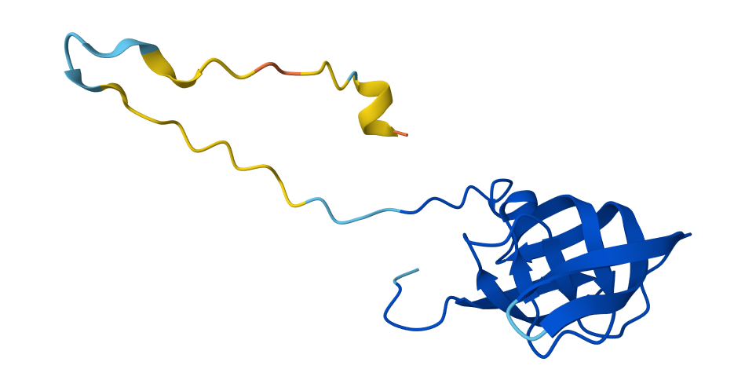
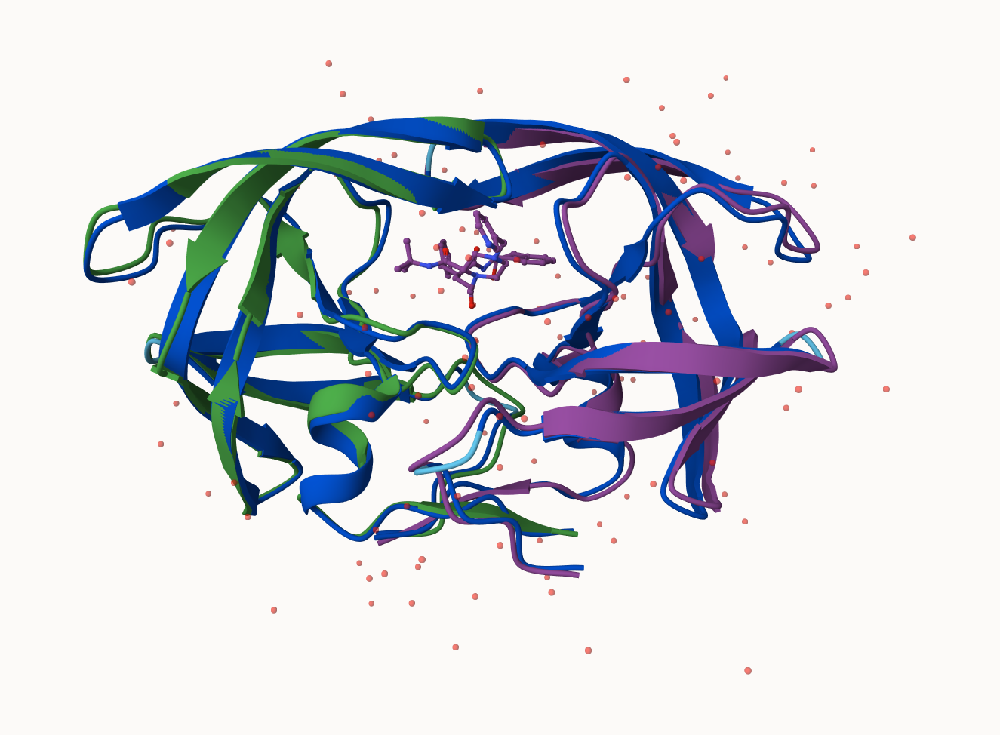
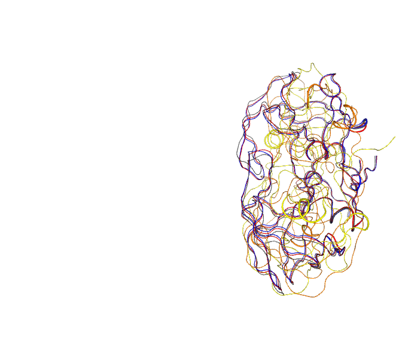
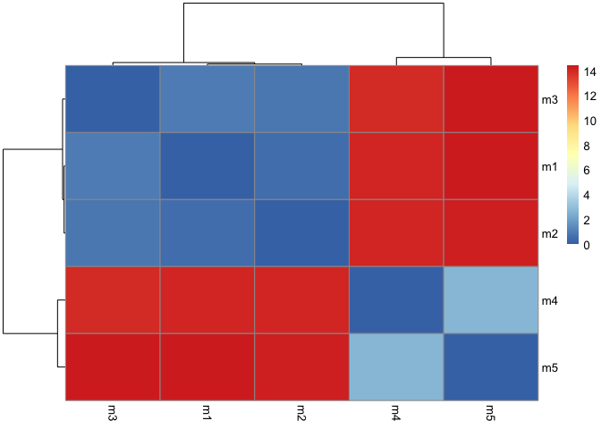
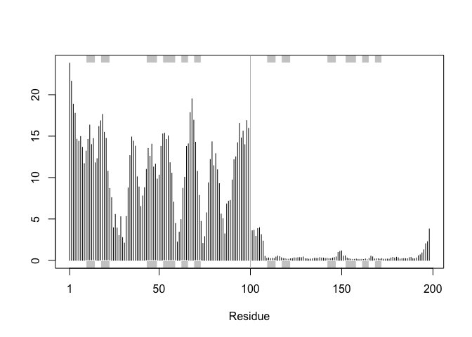

# Class 11: Alpha Fold
Kaliyah Adei-Manu (A18125684)

## Background

We saw last day that the main repository for biomolecular structure (the
PDB database) only has ~250,000 entries.

UniProtKB (the main sequence database) has over 200 million entries!

## AlphaFold

In this hands-on session we will utilize AlphaFold to predict protein
structure from sequence

Without the aid of such approaches, it can take years of expensive
laboratory work to determine the structure of just one protein. With
AlphaFold we can now accurately compute a typical protein structure in
as little as ten minutes.

## The EBI AlphaFold database

The EBI alphafold database contains lots of computed structure models.
It is increasingly likely that the structure you are interested in is
already in this database at \< https://alphafold.ebi.ac.uk/

There are 3 major outputs from AlphaFold

1.  A model of structure in PDB format
2.  A plDDT score : that tells us how confidnet the modle is for a given
    residue in your protein (High values are good above 70)
3.  a **PAE score** that tells us about protein packing quality

If you can’t find the matching entry for the sequence you are interested
in AFDB you can run AlphaFold yourself…

## Running AlphaFold

We will use CollabFold to run our AlphaFold sequence \<
https://colab.research.google.com/github/sokrypton/ColabFold/blob/main/AlphaFold2.ipynb

Figure from AlphaFold here!



## Interpreting Results

Custom analysis resulting models

Molstar image



We can read all the alphafold results into R and do more quantative
analysis than just viewing the structure in Mol-Star

Read all the PDB modles

``` r
library(bio3d)
p <- read.pdb("hivpr_23119_unrelaxed_rank_001_alphafold2_multimer_v3_model_4_seed_000.pdb")
```

``` r
pdb_files<- list.files("hivpr_23119/", pattern = ".pdb", full.names = T)
library(bio3d)

pdbs <- pdbaln(pdb_files, fit=TRUE, exefile="msa")
```

    Reading PDB files:
    hivpr_23119//hivpr_23119_unrelaxed_rank_001_alphafold2_multimer_v3_model_4_seed_000.pdb
    hivpr_23119//hivpr_23119_unrelaxed_rank_002_alphafold2_multimer_v3_model_1_seed_000.pdb
    hivpr_23119//hivpr_23119_unrelaxed_rank_003_alphafold2_multimer_v3_model_5_seed_000.pdb
    hivpr_23119//hivpr_23119_unrelaxed_rank_004_alphafold2_multimer_v3_model_2_seed_000.pdb
    hivpr_23119//hivpr_23119_unrelaxed_rank_005_alphafold2_multimer_v3_model_3_seed_000.pdb
    .....

    Extracting sequences

    pdb/seq: 1   name: hivpr_23119//hivpr_23119_unrelaxed_rank_001_alphafold2_multimer_v3_model_4_seed_000.pdb 
    pdb/seq: 2   name: hivpr_23119//hivpr_23119_unrelaxed_rank_002_alphafold2_multimer_v3_model_1_seed_000.pdb 
    pdb/seq: 3   name: hivpr_23119//hivpr_23119_unrelaxed_rank_003_alphafold2_multimer_v3_model_5_seed_000.pdb 
    pdb/seq: 4   name: hivpr_23119//hivpr_23119_unrelaxed_rank_004_alphafold2_multimer_v3_model_2_seed_000.pdb 
    pdb/seq: 5   name: hivpr_23119//hivpr_23119_unrelaxed_rank_005_alphafold2_multimer_v3_model_3_seed_000.pdb 

``` r
library(bio3dview)
view.pdbs(pdbs)
```



``` r
rd <- rmsd(pdbs, fit=T)
```

    Warning in rmsd(pdbs, fit = T): No indices provided, using the 198 non NA positions

``` r
library(pheatmap)

colnames(rd) <- paste0("m",1:5)
rownames(rd) <- paste0("m",1:5)
pheatmap(rd)
```



``` r
# Read a reference PDB structure
pdb <- read.pdb("1hsg")
```

      Note: Accessing on-line PDB file

``` r
plotb3(pdbs$b[1,], typ="l", lwd=2, sse=pdb)
points(pdbs$b[2,], typ="l", col="red")
points(pdbs$b[3,], typ="l", col="blue")
points(pdbs$b[4,], typ="l", col="darkgreen")
points(pdbs$b[5,], typ="l", col="orange")
abline(v=100, col="gray")
```


``` r
core <- head(core.find(pdbs))
```

     core size 197 of 198  vol = 8545.071 
     core size 196 of 198  vol = 7895.678 
     core size 195 of 198  vol = 3578.372 
     core size 194 of 198  vol = 1851.165 
     core size 193 of 198  vol = 1697.196 
     core size 192 of 198  vol = 1612.763 
     core size 191 of 198  vol = 1530.195 
     core size 190 of 198  vol = 1447.395 
     core size 189 of 198  vol = 1377.104 
     core size 188 of 198  vol = 1303.813 
     core size 187 of 198  vol = 1239.028 
     core size 186 of 198  vol = 1188.127 
     core size 185 of 198  vol = 1118.462 
     core size 184 of 198  vol = 1071.664 
     core size 183 of 198  vol = 1034.006 
     core size 182 of 198  vol = 980.826 
     core size 181 of 198  vol = 942.239 
     core size 180 of 198  vol = 911.387 
     core size 179 of 198  vol = 879.749 
     core size 178 of 198  vol = 834.459 
     core size 177 of 198  vol = 785.261 
     core size 176 of 198  vol = 762.115 
     core size 175 of 198  vol = 722.023 
     core size 174 of 198  vol = 700.389 
     core size 173 of 198  vol = 677.251 
     core size 172 of 198  vol = 657.804 
     core size 171 of 198  vol = 632.902 
     core size 170 of 198  vol = 614.193 
     core size 169 of 198  vol = 591.511 
     core size 168 of 198  vol = 573.974 
     core size 167 of 198  vol = 552.398 
     core size 166 of 198  vol = 529.484 
     core size 165 of 198  vol = 500.54 
     core size 164 of 198  vol = 482.513 
     core size 163 of 198  vol = 458.422 
     core size 162 of 198  vol = 444.451 
     core size 161 of 198  vol = 433.577 
     core size 160 of 198  vol = 419.082 
     core size 159 of 198  vol = 404.931 
     core size 158 of 198  vol = 393.799 
     core size 157 of 198  vol = 382.999 
     core size 156 of 198  vol = 366.651 
     core size 155 of 198  vol = 352.023 
     core size 154 of 198  vol = 335.659 
     core size 153 of 198  vol = 319.395 
     core size 152 of 198  vol = 307.932 
     core size 151 of 198  vol = 296.815 
     core size 150 of 198  vol = 284.286 
     core size 149 of 198  vol = 273.457 
     core size 148 of 198  vol = 261.975 
     core size 147 of 198  vol = 249.597 
     core size 146 of 198  vol = 237.951 
     core size 145 of 198  vol = 226.098 
     core size 144 of 198  vol = 213.263 
     core size 143 of 198  vol = 200.212 
     core size 142 of 198  vol = 187.502 
     core size 141 of 198  vol = 177.523 
     core size 140 of 198  vol = 167.371 
     core size 139 of 198  vol = 160.874 
     core size 138 of 198  vol = 154.453 
     core size 137 of 198  vol = 148.438 
     core size 136 of 198  vol = 142.129 
     core size 135 of 198  vol = 136.528 
     core size 134 of 198  vol = 130.768 
     core size 133 of 198  vol = 123.867 
     core size 132 of 198  vol = 117.608 
     core size 131 of 198  vol = 112.709 
     core size 130 of 198  vol = 106.36 
     core size 129 of 198  vol = 100.59 
     core size 128 of 198  vol = 95.717 
     core size 127 of 198  vol = 91.067 
     core size 126 of 198  vol = 86.861 
     core size 125 of 198  vol = 82.309 
     core size 124 of 198  vol = 78.554 
     core size 123 of 198  vol = 74.632 
     core size 122 of 198  vol = 70.489 
     core size 121 of 198  vol = 66.802 
     core size 120 of 198  vol = 62.901 
     core size 119 of 198  vol = 59.152 
     core size 118 of 198  vol = 55.75 
     core size 117 of 198  vol = 51.831 
     core size 116 of 198  vol = 48.3 
     core size 115 of 198  vol = 44.926 
     core size 114 of 198  vol = 42.417 
     core size 113 of 198  vol = 39.425 
     core size 112 of 198  vol = 37.381 
     core size 111 of 198  vol = 33.06 
     core size 110 of 198  vol = 28.153 
     core size 109 of 198  vol = 25.33 
     core size 108 of 198  vol = 22.509 
     core size 107 of 198  vol = 20.695 
     core size 106 of 198  vol = 18.754 
     core size 105 of 198  vol = 17.757 
     core size 104 of 198  vol = 16.712 
     core size 103 of 198  vol = 15.44 
     core size 102 of 198  vol = 14.745 
     core size 101 of 198  vol = 14.758 
     core size 100 of 198  vol = 13.11 
     core size 99 of 198  vol = 11.018 
     core size 98 of 198  vol = 8.967 
     core size 97 of 198  vol = 7.643 
     core size 96 of 198  vol = 6.326 
     core size 95 of 198  vol = 5.37 
     core size 94 of 198  vol = 4.312 
     core size 93 of 198  vol = 3.391 
     core size 92 of 198  vol = 2.697 
     core size 91 of 198  vol = 1.911 
     core size 90 of 198  vol = 1.577 
     core size 89 of 198  vol = 1.144 
     core size 88 of 198  vol = 0.826 
     core size 87 of 198  vol = 0.594 
     core size 86 of 198  vol = 0.494 
     FINISHED: Min vol ( 0.5 ) reached

``` r
core.inds <- print(core, vol=0.5)
```

    $volume
      [1] 8545.0705552 7895.6784058 3578.3718628 1851.1653358 1697.1961109
      [6] 1612.7629877 1530.1952949 1447.3948207 1377.1037359 1303.8134960
     [11] 1239.0276978 1188.1268458 1118.4624191 1071.6636902 1034.0058407
     [16]  980.8264762  942.2391823  911.3871164  879.7487199  834.4586066
     [21]  785.2612903  762.1154801  722.0231050  700.3893568  677.2509971
     [26]  657.8038446  632.9015694  614.1929640  591.5107404  573.9740969
     [31]  552.3978096  529.4842569  500.5403265  482.5129681  458.4221520
     [36]  444.4508470  433.5769416  419.0822622  404.9307185  393.7993873
     [41]  382.9990236  366.6507378  352.0231809  335.6594907  319.3945905
     [46]  307.9323165  296.8147933  284.2864704  273.4567612  261.9750430
     [51]  249.5973495  237.9512556  226.0978579  213.2633031  200.2124615
     [56]  187.5022729  177.5234630  167.3705918  160.8737473  154.4531901
     [61]  148.4377836  142.1289055  136.5276825  130.7684856  123.8667974
     [66]  117.6082901  112.7087680  106.3602661  100.5903462   95.7172441
     [71]   91.0672681   86.8611169   82.3087332   78.5536329   74.6317801
     [76]   70.4885771   66.8018501   62.9009446   59.1519775   55.7499833
     [81]   51.8314866   48.2999311   44.9264984   42.4174986   39.4246868
     [86]   37.3811348   33.0596303   28.1534345   25.3298750   22.5093980
     [91]   20.6952094   18.7535194   17.7573185   16.7116891   15.4399854
     [96]   14.7445081   14.7579895   13.1096459   11.0176396    8.9674893
    [101]    7.6433096    6.3256353    5.3698450    4.3117289    3.3909659
    [106]    2.6972786    1.9113381    1.5768158    1.1438798    0.8263711
    [111]    0.5941798    0.4940971           NA           NA           NA
    [116]           NA           NA           NA           NA           NA
    [121]           NA           NA           NA           NA           NA
    [126]           NA           NA           NA           NA           NA
    [131]           NA           NA           NA           NA           NA
    [136]           NA           NA           NA           NA           NA
    [141]           NA           NA           NA           NA           NA
    [146]           NA           NA           NA           NA           NA
    [151]           NA           NA           NA           NA           NA
    [156]           NA           NA           NA           NA           NA
    [161]           NA           NA           NA           NA           NA
    [166]           NA           NA           NA           NA           NA
    [171]           NA           NA           NA           NA           NA
    [176]           NA           NA           NA           NA           NA
    [181]           NA           NA           NA           NA           NA
    [186]           NA           NA           NA           NA           NA
    [191]           NA           NA           NA           NA           NA
    [196]           NA           NA           NA

    $length
      [1] 197 196 195 194 193 192 191 190 189 188 187 186 185 184 183 182 181 180
     [19] 179 178 177 176 175 174 173 172 171 170 169 168 167 166 165 164 163 162
     [37] 161 160 159 158 157 156 155 154 153 152 151 150 149 148 147 146 145 144
     [55] 143 142 141 140 139 138 137 136 135 134 133 132 131 130 129 128 127 126
     [73] 125 124 123 122 121 120 119 118 117 116 115 114 113 112 111 110 109 108
     [91] 107 106 105 104 103 102 101 100  99  98  97  96  95  94  93  92  91  90
    [109]  89  88  87  86  NA  NA  NA  NA  NA  NA  NA  NA  NA  NA  NA  NA  NA  NA
    [127]  NA  NA  NA  NA  NA  NA  NA  NA  NA  NA  NA  NA  NA  NA  NA  NA  NA  NA
    [145]  NA  NA  NA  NA  NA  NA  NA  NA  NA  NA  NA  NA  NA  NA  NA  NA  NA  NA
    [163]  NA  NA  NA  NA  NA  NA  NA  NA  NA  NA  NA  NA  NA  NA  NA  NA  NA  NA
    [181]  NA  NA  NA  NA  NA  NA  NA  NA  NA  NA  NA  NA  NA  NA  NA  NA  NA  NA

    $resno
      [1] 53 52 46 51 44 55 45 54 48 47 43  1 49 56  7 50 57 79  3  2 35 68 42 78 36
     [26] 81 37 58 41 34 80  6 77 67 18 38 19 76 40 39 82 59 17 20 33 16 21 32 83 15
     [51] 14 12  5 98  4 13 99  6 60 75 29 74 22 91 11 30 92 88 28 65 10 66 64 63  8
     [76] 27 87 69 71 93 90  9 62 70 72  2  1 89  3 96  7 73 94 26 97 61 86 24 84 99
    [101] 23 95 85 25  5 31  4 98 97 51 96 49  8  9 10 11 12 13 14 15 16 17 18 19 20
    [126] 21 22 23 24 25 26 27 28 29 30 31 32 33 34 35 36 37 38 39 40 41 42 43 44 45
    [151] 46 47 48 50 52 53 54 55 56 57 58 59 60 61 62 63 64 65 66 67 68 69 70 71 72
    [176] 73 74 75 76 77 78 79 80 81 82 83 84 85 86 87 88 89 90 91 92 93 94 95

    $step.inds
      [1]  53  52  46  51  44  55  45  54  48  47  43   1  49  56   7  50  57  79
     [19]   3   2  35  68  42  78  36  81  37  58  41  34  80   6  77  67  18  38
     [37]  19  76  40  39  82  59  17  20  33  16  21  32  83  15  14  12   5  98
     [55]   4  13  99 105  60  75  29  74  22  91  11  30  92  88  28  65  10  66
     [73]  64  63   8  27  87  69  71  93  90   9  62  70  72 101 100  89 102  96
     [91] 106  73  94  26  97  61  86  24  84 198  23  95  85  25 104  31 103 197
    [109] 196 150 195 148 107 108 109 110 111 112 113 114 115 116 117 118 119 120
    [127] 121 122 123 124 125 126 127 128 129 130 131 132 133 134 135 136 137 138
    [145] 139 140 141 142 143 144 145 146 147 149 151 152 153 154 155 156 157 158
    [163] 159 160 161 162 163 164 165 166 167 168 169 170 171 172 173 174 175 176
    [181] 177 178 179 180 181 182 183 184 185 186 187 188 189 190 191 192 193 194

    $atom
     [1] 107 108 109 110 111 112 113 114 115 116 117 118 119 120 121 122 123 124 125
    [20] 126 127 128 129 130 131 132 133 134 135 136 137 138 139 140 141 142 143 144
    [39] 145 146 147 148 149 151 152 153 154 155 156 157 158 159 160 161 162 163 164
    [58] 165 166 167 168 169 170 171 172 173 174 175 176 177 178 179 180 181 182 183
    [77] 184 185 186 187 188 189 190 191 192 193 194

    $xyz
      [1] 319 320 321 322 323 324 325 326 327 328 329 330 331 332 333 334 335 336
     [19] 337 338 339 340 341 342 343 344 345 346 347 348 349 350 351 352 353 354
     [37] 355 356 357 358 359 360 361 362 363 364 365 366 367 368 369 370 371 372
     [55] 373 374 375 376 377 378 379 380 381 382 383 384 385 386 387 388 389 390
     [73] 391 392 393 394 395 396 397 398 399 400 401 402 403 404 405 406 407 408
     [91] 409 410 411 412 413 414 415 416 417 418 419 420 421 422 423 424 425 426
    [109] 427 428 429 430 431 432 433 434 435 436 437 438 439 440 441 442 443 444
    [127] 445 446 447 451 452 453 454 455 456 457 458 459 460 461 462 463 464 465
    [145] 466 467 468 469 470 471 472 473 474 475 476 477 478 479 480 481 482 483
    [163] 484 485 486 487 488 489 490 491 492 493 494 495 496 497 498 499 500 501
    [181] 502 503 504 505 506 507 508 509 510 511 512 513 514 515 516 517 518 519
    [199] 520 521 522 523 524 525 526 527 528 529 530 531 532 533 534 535 536 537
    [217] 538 539 540 541 542 543 544 545 546 547 548 549 550 551 552 553 554 555
    [235] 556 557 558 559 560 561 562 563 564 565 566 567 568 569 570 571 572 573
    [253] 574 575 576 577 578 579 580 581 582

``` r
xyz <- pdbfit(pdbs, core.inds, outpath="corefit_structures")
```

``` r
rf <- rmsf(xyz)

plotb3(rf, sse=pdb)
abline(v=100, col="gray", ylab="RMSF")
```


