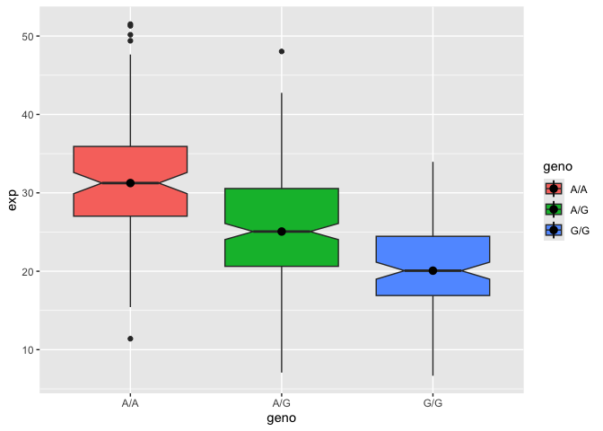

# Class 12
Kaliyah Adei-Manu (A18125684)
2026-02-12

# Section 1. Proportion of G/G in a population

Downloaded a CSV file from Ensemble \<
https://www.ensembl.org/Homo_sapiens/Variation/Sample?db=core;r=17:39770110-40020111;v=rs8067378;vdb=variation;vf=959672880#373531_tablePanel
\>

Here we read this CSV file

``` r
mxl <- read.csv("373531-SampleGenotypes-Homo_sapiens_Variation_Sample_rs8067378.csv")
head(mxl)
```

      Sample..Male.Female.Unknown. Genotype..forward.strand. Population.s. Father
    1                  NA19648 (F)                       A|A ALL, AMR, MXL      -
    2                  NA19649 (M)                       G|G ALL, AMR, MXL      -
    3                  NA19651 (F)                       A|A ALL, AMR, MXL      -
    4                  NA19652 (M)                       G|G ALL, AMR, MXL      -
    5                  NA19654 (F)                       G|G ALL, AMR, MXL      -
    6                  NA19655 (M)                       A|G ALL, AMR, MXL      -
      Mother
    1      -
    2      -
    3      -
    4      -
    5      -
    6      -

``` r
table(mxl$Genotype..forward.strand.)
```


    A|A A|G G|A G|G 
     22  21  12   9 

``` r
table(mxl$Genotype..forward.strand.) / nrow(mxl) *100
```


        A|A     A|G     G|A     G|G 
    34.3750 32.8125 18.7500 14.0625 

Now let’s look at a different population, GBR.

``` r
gbr <- read.csv("373522-SampleGenotypes-Homo_sapiens_Variation_Sample_rs8067378.csv")
head(gbr)
```

      Sample..Male.Female.Unknown. Genotype..forward.strand. Population.s. Father
    1                  HG00096 (M)                       A|A ALL, EUR, GBR      -
    2                  HG00097 (F)                       G|A ALL, EUR, GBR      -
    3                  HG00099 (F)                       G|G ALL, EUR, GBR      -
    4                  HG00100 (F)                       A|A ALL, EUR, GBR      -
    5                  HG00101 (M)                       A|A ALL, EUR, GBR      -
    6                  HG00102 (F)                       A|A ALL, EUR, GBR      -
      Mother
    1      -
    2      -
    3      -
    4      -
    5      -
    6      -

Find the proportion of G/G

``` r
round(table(gbr$Genotype..forward.strand.) / nrow(gbr) * 100, 2)
```


      A|A   A|G   G|A   G|G 
    25.27 18.68 26.37 29.67 

This variant that is associated with childhood asthma is more frequent
in the GBR population than the MXL population.

Lets now dig into this further.

## Section 4: Population Scale Analysis

One sample is obviously not enough to kow what is happening in a
population. You are interested in assessing genetic differences on a
population scale.

So, you proceed about ~230 samples and did the normalization on a genome
level. Now, you want to find whether there is any association of the 4
asthma- associated SNPs (rs8067378…)on ORMDL3 expression.

How many smaples do we have?

> Q13. Read this file into R and determine the sample size for each
> genotype and their corresponding median expression levels for each of
> these genotypes.

``` r
 expr <- read.table("rs8067378_ENSG00000172057.6.txt")
head(expr)
```

       sample geno      exp
    1 HG00367  A/G 28.96038
    2 NA20768  A/G 20.24449
    3 HG00361  A/A 31.32628
    4 HG00135  A/A 34.11169
    5 NA18870  G/G 18.25141
    6 NA11993  A/A 32.89721

``` r
nrow(expr)
```

    [1] 462

``` r
table(expr$geno)
```


    A/A A/G G/G 
    108 233 121 

``` r
tapply(expr$exp, expr$geno, median, na.rm = TRUE)
```

         A/A      A/G      G/G 
    31.24847 25.06486 20.07363 

median expression of A/A is 31.25, for A/G its 25.06 and for G/G its
20.07.

> Q14. Generate a boxplot with a box per genotype, what could you infer
> from the relative expression value between A/A and G/G displayed in
> this plot? Does the SNP effect the expression of ORMDL3?

``` r
library(ggplot2)
```

Lets make a boxplot

``` r
ggplot(expr) + aes(geno, exp, fill= geno)+
  geom_boxplot(notch=TRUE)+
  stat_summary(fun= median)
```

    Warning: Removed 3 rows containing missing values or values outside the scale range
    (`geom_segment()`).



Yes different genotypes, A/A, A/g and G/G effects the expression of
ORMDL3, we can see in this boxplot that G/G is associated with lower
gene expression of this gene then A/A and A/G.
