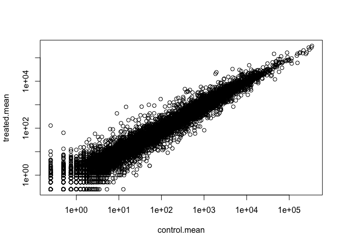
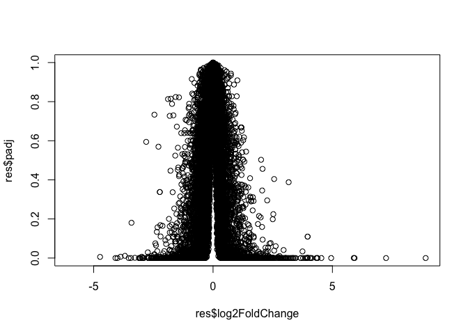
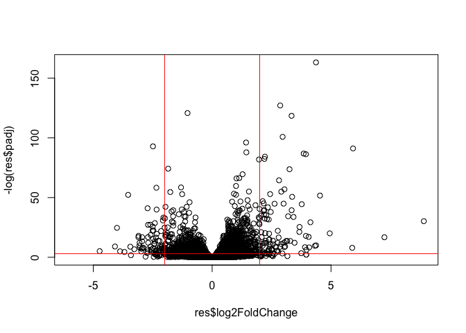
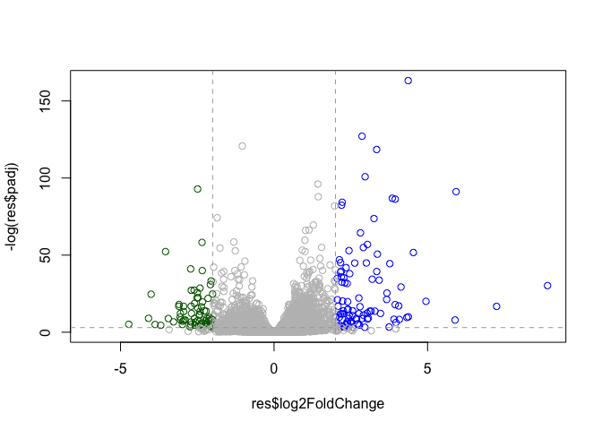
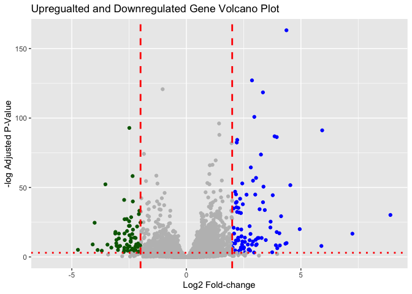

# Class 13
Kaliyah Adeimanu (A18125684)

## Background

Today we will perform an RNASeq analysis of the effects of a common
sertoid on airways cells

In particular, dexamethasone (herafter just called “dex”) on different
airways smooth muscle cell lines (ASM cells).

## Data Import

We need two different inputs:

- **countData**: with genes in rows and experiments in columns
- **colData**:meta data that describes the columns in countData

``` r
counts <- read.csv("airway_scaledcounts.csv",row.names=1)
metadata <- read.csv("airway_metadata.csv")
```

Have a look at counts and metadata

``` r
head(counts)
```

                    SRR1039508 SRR1039509 SRR1039512 SRR1039513 SRR1039516
    ENSG00000000003        723        486        904        445       1170
    ENSG00000000005          0          0          0          0          0
    ENSG00000000419        467        523        616        371        582
    ENSG00000000457        347        258        364        237        318
    ENSG00000000460         96         81         73         66        118
    ENSG00000000938          0          0          1          0          2
                    SRR1039517 SRR1039520 SRR1039521
    ENSG00000000003       1097        806        604
    ENSG00000000005          0          0          0
    ENSG00000000419        781        417        509
    ENSG00000000457        447        330        324
    ENSG00000000460         94        102         74
    ENSG00000000938          0          0          0

``` r
metadata
```

              id     dex celltype     geo_id
    1 SRR1039508 control   N61311 GSM1275862
    2 SRR1039509 treated   N61311 GSM1275863
    3 SRR1039512 control  N052611 GSM1275866
    4 SRR1039513 treated  N052611 GSM1275867
    5 SRR1039516 control  N080611 GSM1275870
    6 SRR1039517 treated  N080611 GSM1275871
    7 SRR1039520 control  N061011 GSM1275874
    8 SRR1039521 treated  N061011 GSM1275875

> Q1. How many genes are in this dataset?

``` r
nrow(counts)
```

    [1] 38694

> Q2. How many ‘control’ cell lines do we have?

``` r
table(metadata$dex)
```


    control treated 
          4       4 

There are 4 control cell lines

## Differential gene expression

We have four replicate treated and control (no drug) columns /
experiments in out `counts`object.

We want one “mean” value for each gene (rows) in “treated” and one mean
value for ecah gene in “control” columns.

Step 1. Find all “control” columns in `counts` Step 2. extract these
columns to a new object called `control.counts` step 3. Then calculate
the mean vlaue for each gene

Step 1.

``` r
metadata$dex == "control"
```

    [1]  TRUE FALSE  TRUE FALSE  TRUE FALSE  TRUE FALSE

Step 2.

``` r
metadata
```

              id     dex celltype     geo_id
    1 SRR1039508 control   N61311 GSM1275862
    2 SRR1039509 treated   N61311 GSM1275863
    3 SRR1039512 control  N052611 GSM1275866
    4 SRR1039513 treated  N052611 GSM1275867
    5 SRR1039516 control  N080611 GSM1275870
    6 SRR1039517 treated  N080611 GSM1275871
    7 SRR1039520 control  N061011 GSM1275874
    8 SRR1039521 treated  N061011 GSM1275875

``` r
control.inds <- metadata$dex == "control"
```

``` r
control.counts <- counts[, control.inds]
```

``` r
head(control.counts)
```

                    SRR1039508 SRR1039512 SRR1039516 SRR1039520
    ENSG00000000003        723        904       1170        806
    ENSG00000000005          0          0          0          0
    ENSG00000000419        467        616        582        417
    ENSG00000000457        347        364        318        330
    ENSG00000000460         96         73        118        102
    ENSG00000000938          0          1          2          0

Step 3.

``` r
control.mean<- rowMeans(control.counts)
```

``` r
head(control.mean)
```

    ENSG00000000003 ENSG00000000005 ENSG00000000419 ENSG00000000457 ENSG00000000460 
             900.75            0.00          520.50          339.75           97.25 
    ENSG00000000938 
               0.75 

> Q3.How would you make the above code in either approach more robust?
> Is there a function that could help here?

Using `rowMeans()` is more effective then using row sums and manually
calculating the mean using the number of rows.

> Q4. Now do the smae thing for the “treated” columns/ experiments…

step 1.

``` r
metadata$dex == "treated"
```

    [1] FALSE  TRUE FALSE  TRUE FALSE  TRUE FALSE  TRUE

step 2.

``` r
treated.inds <- metadata$dex == "treated"
```

``` r
treated.counts <- counts[, treated.inds]
```

``` r
head(treated.counts)
```

                    SRR1039509 SRR1039513 SRR1039517 SRR1039521
    ENSG00000000003        486        445       1097        604
    ENSG00000000005          0          0          0          0
    ENSG00000000419        523        371        781        509
    ENSG00000000457        258        237        447        324
    ENSG00000000460         81         66         94         74
    ENSG00000000938          0          0          0          0

step 3.

``` r
treated.mean <- rowMeans(treated.counts)
```

``` r
head(treated.mean)
```

    ENSG00000000003 ENSG00000000005 ENSG00000000419 ENSG00000000457 ENSG00000000460 
             658.00            0.00          546.00          316.50           78.75 
    ENSG00000000938 
               0.00 

Put these together for easy book-keeping as `meancounts`

``` r
meancounts <- data.frame(control.mean, treated.mean)
```

> Q5a. Create a scatter plot showing the mean of the treated samples
> against the mean of the control samples using base R

A quick plot

``` r
plot(meancounts)
```


> Q5b. Create a scatter plot showing the mean of the treated samples
> against the mean of the control samples using ggplot

``` r
library(ggplot2)
ggplot(meancounts, aes(control.mean, treated.mean)) + geom_point()
```


> Q6. Try plotting both axes on a log scale. What is the argument to
> plot() that allows you to do this?

`log` allows us to do this.  
Let’s log transform this count data:

``` r
plot(control.mean, treated.mean, log="xy")
```

    Warning in xy.coords(x, y, xlabel, ylabel, log): 15032 x values <= 0 omitted
    from logarithmic plot

    Warning in xy.coords(x, y, xlabel, ylabel, log): 15281 y values <= 0 omitted
    from logarithmic plot



**N.B** We most often use log2 for this type of data as it makes the
interpretation much more striaghtforward.

Treated/Control is often called “fold-change”

If there was no change we would have log2-fc of zero:

``` r
log2(10/10)
```

    [1] 0

If we had double of gene transcript we would have log2-fc of 1

``` r
log2(20/10)
```

    [1] 1

If we had half as much gene transcript we would have log2-fc of -1

``` r
log2(5/10)
```

    [1] -1

> Q. Calculate the log2 fold change value for all of our genes and add
> it as a new column to our `meancounts` object

``` r
meancounts$log2fc <- log2(meancounts$treated.mean / meancounts$control.mean)
head(meancounts)
```

                    control.mean treated.mean      log2fc
    ENSG00000000003       900.75       658.00 -0.45303916
    ENSG00000000005         0.00         0.00         NaN
    ENSG00000000419       520.50       546.00  0.06900279
    ENSG00000000457       339.75       316.50 -0.10226805
    ENSG00000000460        97.25        78.75 -0.30441833
    ENSG00000000938         0.75         0.00        -Inf

``` r
zero.vals <- which(meancounts[,1:2]==0, arr.ind=TRUE)

to.rm <- unique(zero.vals[,1])
mycounts <- meancounts[-to.rm,]
head(mycounts)
```

                    control.mean treated.mean      log2fc
    ENSG00000000003       900.75       658.00 -0.45303916
    ENSG00000000419       520.50       546.00  0.06900279
    ENSG00000000457       339.75       316.50 -0.10226805
    ENSG00000000460        97.25        78.75 -0.30441833
    ENSG00000000971      5219.00      6687.50  0.35769358
    ENSG00000001036      2327.00      1785.75 -0.38194109

> Q7. What is the purpose of the arr.ind argument in the which()
> function call above? Why would we then take the first column of the
> output and need to call the unique() function?

`arr.ind()` controls the format making it = TRUE means displays the
matrix above. The first coloumn shows all the control means for each
gene.

``` r
up.ind <- mycounts$log2fc > 2
down.ind <- mycounts$log2fc < (-2)
```

> Q8. Using the up.ind vector above can you determine how many up
> regulated genes we have at the greater than 2 fc level?

``` r
sum(up.ind)
```

    [1] 250

250

> Q9. Using the down.ind vector above can you determine how many down
> regulated genes we have at the greater than 2 fc level?

``` r
sum(down.ind)
```

    [1] 367

367

> Q10. Do you trust these results? Why or why not?

Yes I trust these results it has summed up the total of values that are
true meaning the values are greater than 2 or less than -2.

## DESeq analysis

Let’s do this analysis with an estimate of statistical significance
using the **DESeq2** package.

``` r
library(DESeq2)
```

DESeq (like many bioconductor packages ) wants it’s input data in a very
specific way.

``` r
dds <- DESeqDataSetFromMatrix(countData=counts, 
                       colData=metadata, 
                       design = ~dex)
```

    converting counts to integer mode

    Warning in DESeqDataSet(se, design = design, ignoreRank): some variables in
    design formula are characters, converting to factors

### Run the DESeq analysis pipeline

The main function `DESeq()`

``` r
dds<- DESeq(dds)
```

    estimating size factors

    estimating dispersions

    gene-wise dispersion estimates

    mean-dispersion relationship

    final dispersion estimates

    fitting model and testing

``` r
res <- results(dds)
head(res)
```

    log2 fold change (MLE): dex treated vs control 
    Wald test p-value: dex treated vs control 
    DataFrame with 6 rows and 6 columns
                      baseMean log2FoldChange     lfcSE      stat    pvalue
                     <numeric>      <numeric> <numeric> <numeric> <numeric>
    ENSG00000000003 747.194195     -0.3507030  0.168246 -2.084470 0.0371175
    ENSG00000000005   0.000000             NA        NA        NA        NA
    ENSG00000000419 520.134160      0.2061078  0.101059  2.039475 0.0414026
    ENSG00000000457 322.664844      0.0245269  0.145145  0.168982 0.8658106
    ENSG00000000460  87.682625     -0.1471420  0.257007 -0.572521 0.5669691
    ENSG00000000938   0.319167     -1.7322890  3.493601 -0.495846 0.6200029
                         padj
                    <numeric>
    ENSG00000000003  0.163035
    ENSG00000000005        NA
    ENSG00000000419  0.176032
    ENSG00000000457  0.961694
    ENSG00000000460  0.815849
    ENSG00000000938        NA

## Volcano Plot

This is a main summary results figure from these kinds of studies. It is
a plot of Log2 Fold-change vs Adjusted P-value.

``` r
plot(res$log2FoldChange, 
     res$padj)
```



Again this y-axis is highly skewed, needs a log transformation and we
can flip the y-axis with a minus sign so it looks like every other
volcano plot.

``` r
plot(res$log2FoldChange,-log(res$padj))
abline(v=-2, col="red")
abline(v=+2, col="red")
abline(h= -log(0.05), col="red")
```



### Addding some color annotation

Start with a default base color “gray”

``` r
mycols <- rep("gray", nrow(res))
mycols [res$log2FoldChange > 2 ] <- "blue"
mycols [res$log2FoldChange < -2 ] <- "darkgreen"
mycols [res$padj >= 0.05] <- "gray"

plot(res$log2FoldChange,
     -log(res$padj),
     col=mycols)
```


``` r
# custom colors
mycols <- rep("gray", nrow(res))
mycols [res$log2FoldChange > 2 ] <- "blue"
mycols [res$log2FoldChange < -2 ] <- "darkgreen"
mycols [res$padj >= 0.05] <- "gray"

# Plot 
plot(res$log2FoldChange,
     -log(res$padj),
     col=mycols)

# Add some cut-off lines
abline(v= c(-2,2), col="darkgray", lty=2)
abline(h=-log(0.05), col="darkgray", lty=2)
```



> Q. Make a presentation quality ggplot version of this plot, inclued
> clear axis labels, a clean theme, your custom colors, cut-off lines
> and a plot title.

Now a ggplot version:

``` r
library(ggplot2)
ggplot(res, aes(log2FoldChange,
                -log(padj),))+
  geom_point(color= mycols)+
  labs(title="Upregualted and Downregulated Gene Volcano Plot", x="Log2 Fold-change", y="-log Adjusted P-Value") +
    geom_vline(xintercept = -2 , color = "red", linetype = "dashed", size = 1) +
  geom_hline(yintercept = (-log(0.05)), color = "red", linetype = "dotted", size = 1) +
  geom_vline(xintercept = 2 , color = "red", linetype = "dashed", size = 1)
```

    Warning: Using `size` aesthetic for lines was deprecated in ggplot2 3.4.0.
    ℹ Please use `linewidth` instead.

    Warning: Removed 23549 rows containing missing values or values outside the scale range
    (`geom_point()`).



## Save our results

Write a CSV file

``` r
write.csv(res, file="results.csv")
```

## Add Annotation Data

We need to add missing annotation data to our main `res` results object.
This includes the common gene “symbol”

``` r
head(res)
```

    log2 fold change (MLE): dex treated vs control 
    Wald test p-value: dex treated vs control 
    DataFrame with 6 rows and 6 columns
                      baseMean log2FoldChange     lfcSE      stat    pvalue
                     <numeric>      <numeric> <numeric> <numeric> <numeric>
    ENSG00000000003 747.194195     -0.3507030  0.168246 -2.084470 0.0371175
    ENSG00000000005   0.000000             NA        NA        NA        NA
    ENSG00000000419 520.134160      0.2061078  0.101059  2.039475 0.0414026
    ENSG00000000457 322.664844      0.0245269  0.145145  0.168982 0.8658106
    ENSG00000000460  87.682625     -0.1471420  0.257007 -0.572521 0.5669691
    ENSG00000000938   0.319167     -1.7322890  3.493601 -0.495846 0.6200029
                         padj
                    <numeric>
    ENSG00000000003  0.163035
    ENSG00000000005        NA
    ENSG00000000419  0.176032
    ENSG00000000457  0.961694
    ENSG00000000460  0.815849
    ENSG00000000938        NA

We will use R and bioconductor to do this “ID mapping”

``` r
library("AnnotationDbi")
library("org.Hs.eg.db")
```

Lets see what databases we can use for translation/ mapping …

``` r
columns(org.Hs.eg.db)
```

     [1] "ACCNUM"       "ALIAS"        "ENSEMBL"      "ENSEMBLPROT"  "ENSEMBLTRANS"
     [6] "ENTREZID"     "ENZYME"       "EVIDENCE"     "EVIDENCEALL"  "GENENAME"    
    [11] "GENETYPE"     "GO"           "GOALL"        "IPI"          "MAP"         
    [16] "OMIM"         "ONTOLOGY"     "ONTOLOGYALL"  "PATH"         "PFAM"        
    [21] "PMID"         "PROSITE"      "REFSEQ"       "SYMBOL"       "UCSCKG"      
    [26] "UNIPROT"     

We can use the `mapIds()` function now to “translate” between any of
these databases.

``` r
res$symbol <- mapIds(org.Hs.eg.db,
                     keys=row.names(res), # Our genenames
                     keytype="ENSEMBL",   # The format of our genenames
                     column="SYMBOL")     # The new format we want to add
```

    'select()' returned 1:many mapping between keys and columns

> Q11. Also add “ENTREZID” , “GENENAME”

``` r
res$entrezid <-mapIds(org.Hs.eg.db,
                     keys=row.names(res), # Our genenames
                     keytype="ENSEMBL",   # The format of our genenames
                     column="ENTREZID")     # The new format we want to add 
```

    'select()' returned 1:many mapping between keys and columns

``` r
res$genename <- mapIds(org.Hs.eg.db,
                     keys=row.names(res), # Our genenames
                     keytype="ENSEMBL",   # The format of our genenames
                     column="GENENAME")     # The new format we want to add
```

    'select()' returned 1:many mapping between keys and columns

``` r
head(res)
```

    log2 fold change (MLE): dex treated vs control 
    Wald test p-value: dex treated vs control 
    DataFrame with 6 rows and 9 columns
                      baseMean log2FoldChange     lfcSE      stat    pvalue
                     <numeric>      <numeric> <numeric> <numeric> <numeric>
    ENSG00000000003 747.194195     -0.3507030  0.168246 -2.084470 0.0371175
    ENSG00000000005   0.000000             NA        NA        NA        NA
    ENSG00000000419 520.134160      0.2061078  0.101059  2.039475 0.0414026
    ENSG00000000457 322.664844      0.0245269  0.145145  0.168982 0.8658106
    ENSG00000000460  87.682625     -0.1471420  0.257007 -0.572521 0.5669691
    ENSG00000000938   0.319167     -1.7322890  3.493601 -0.495846 0.6200029
                         padj      symbol    entrezid               genename
                    <numeric> <character> <character>            <character>
    ENSG00000000003  0.163035      TSPAN6        7105          tetraspanin 6
    ENSG00000000005        NA        TNMD       64102            tenomodulin
    ENSG00000000419  0.176032        DPM1        8813 dolichyl-phosphate m..
    ENSG00000000457  0.961694       SCYL3       57147 SCY1 like pseudokina..
    ENSG00000000460  0.815849       FIRRM       55732 FIGNL1 interacting r..
    ENSG00000000938        NA         FGR        2268 FGR proto-oncogene, ..

## Save annotated results to a CSV file

``` r
write.csv(res, file="results_annotated.csv")
```

## Pathway analysis

What know biological pathways do our differentially expressed genes
overlap with (i.e. play a role in)

There ar elots of bioconductor packages to do this type of analysis.

We will use one of the oldest called **gage** along with the
**pathview** to render nice pics of the pathways we find.

We can install these with the command:
`BiocManager::install( c("pathview", "gage", "gageData") )`

``` r
library(pathview)
library(gage)
library(gageData)
```

Have a wee peak what is in `gageData`

``` r
# Examine the first 2 pathways in this kegg set for humans
data(kegg.sets.hs)
head(kegg.sets.hs, 2)
```

    $`hsa00232 Caffeine metabolism`
    [1] "10"   "1544" "1548" "1549" "1553" "7498" "9"   

    $`hsa00983 Drug metabolism - other enzymes`
     [1] "10"     "1066"   "10720"  "10941"  "151531" "1548"   "1549"   "1551"  
     [9] "1553"   "1576"   "1577"   "1806"   "1807"   "1890"   "221223" "2990"  
    [17] "3251"   "3614"   "3615"   "3704"   "51733"  "54490"  "54575"  "54576" 
    [25] "54577"  "54578"  "54579"  "54600"  "54657"  "54658"  "54659"  "54963" 
    [33] "574537" "64816"  "7083"   "7084"   "7172"   "7363"   "7364"   "7365"  
    [41] "7366"   "7367"   "7371"   "7372"   "7378"   "7498"   "79799"  "83549" 
    [49] "8824"   "8833"   "9"      "978"   

The main `gage()` function that does the actual work wants a simple
vector as input The KEGG database uses ENTREZ is so we need to provide
these in our input vector for **gage**

``` r
foldchanges <- res$log2FoldChange
names(foldchanges) <- res$entrezid
head(foldchanges)
```

           7105       64102        8813       57147       55732        2268 
    -0.35070302          NA  0.20610777  0.02452695 -0.14714205 -1.73228897 

Now we can run `gage()`

``` r
keggres = gage(foldchanges, gsets=kegg.sets.hs)
```

What is the output object for `kegress`

``` r
attributes(keggres)
```

    $names
    [1] "greater" "less"    "stats"  

``` r
head(keggres$less,3)
```

                                          p.geomean stat.mean        p.val
    hsa05332 Graft-versus-host disease 0.0004250461 -3.473346 0.0004250461
    hsa04940 Type I diabetes mellitus  0.0017820293 -3.002352 0.0017820293
    hsa05310 Asthma                    0.0020045888 -3.009050 0.0020045888
                                            q.val set.size         exp1
    hsa05332 Graft-versus-host disease 0.09053483       40 0.0004250461
    hsa04940 Type I diabetes mellitus  0.14232581       42 0.0017820293
    hsa05310 Asthma                    0.14232581       29 0.0020045888

We can use **pathview** function to render a figure of any of these
pathways along with annotation for our DEGs,.

Let’s see the hsa05310 Asthma pathway with our DEGS colored up.

``` r
pathview(gene.data=foldchanges, pathway.id="hsa05310")
```

    'select()' returned 1:1 mapping between keys and columns

    Info: Working in directory /Users/kaliyahadeimanu/Desktop/BIMM143/bimm_143_github/Class13

    Info: Writing image file hsa05310.pathview.png


> Q12. Can you render and insert here the pathway figure for
> “Graft-versus-host disease” and “Type 1 diabetes”?

Graft-verus-host

``` r
pathview(gene.data=foldchanges, pathway.id="hsa05332")
```

    'select()' returned 1:1 mapping between keys and columns

    Info: Working in directory /Users/kaliyahadeimanu/Desktop/BIMM143/bimm_143_github/Class13

    Info: Writing image file hsa05332.pathview.png


Type 1 Diabetes

``` r
pathview(gene.data=foldchanges, pathway.id="hsa04940")
```

    'select()' returned 1:1 mapping between keys and columns

    Info: Working in directory /Users/kaliyahadeimanu/Desktop/BIMM143/bimm_143_github/Class13

    Info: Writing image file hsa04940.pathview.png


