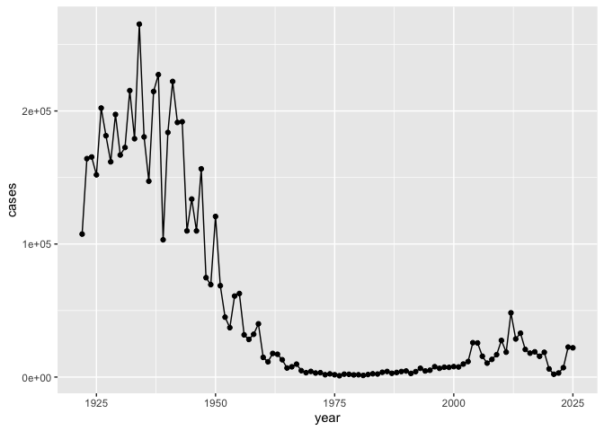
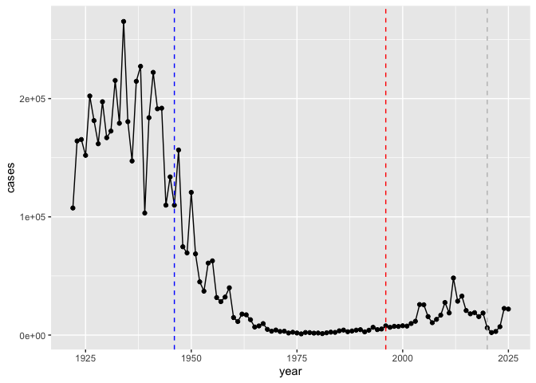
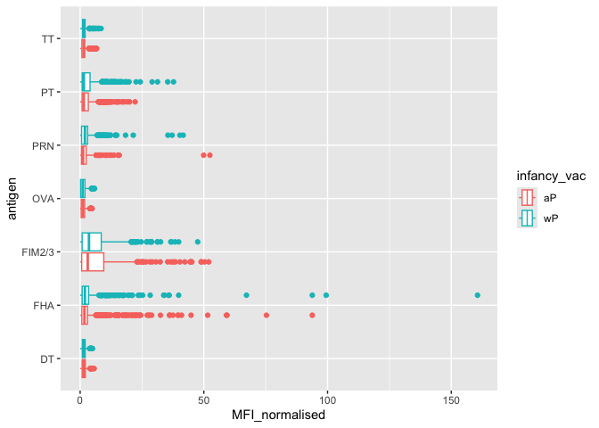
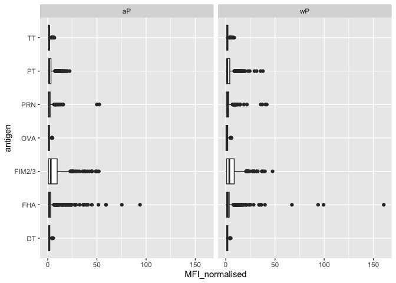
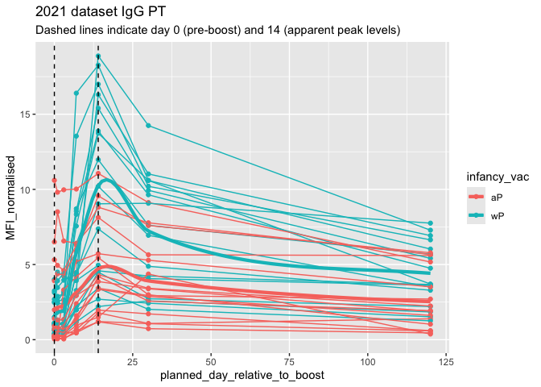

# Class 18 Pertussis Mini Project
Kaliyah Adei-Manu (A18125684)

# Background

Pertussis (whooping cough) is a common lung infection casued by the
bacteria B. Pertussis. It can infect anyone but is most deadly for
infants (under 1 year of age)

# CDC tracking data

The CDC tracks the number of Pertussis cases:

``` r
head(cdc)
```

      year  cases
    1 1922 107473
    2 1923 164191
    3 1924 165418
    4 1925 152003
    5 1926 202210
    6 1927 181411

> Q1. I want a plot of year vs cases

``` r
library (ggplot2)

ggplot(cdc)+
  aes(year,cases) +
  geom_point()+
  geom_line()
```



> Q2. Add annotation lines for the major milestones of wP vaccination
> roll-out (1946) and the switch to the aP vaccine(1996).

``` r
ggplot(cdc)+
  aes(year,cases) +
  geom_point()+
  geom_line()+
  geom_vline(xintercept= 1946, col="blue",lty=2)+
  geom_vline(xintercept= 1996, col="red", lty=2) +
  geom_vline(xintercept=2020, col="gray", lty=2)
```



> Q3. Describe what happened after the introduction of the aP vaccine?
> Do you have a possible explanation for the observed trend?

In 1946, when the initial vaccine for pertussis was rolled out which was
the wP vaccine, we see a rapid decline in the number of cases of
Pertussis reported annually suggesting the effectiveness of this vaccine
in controlling the spread of this illness. In 1996 a new vaccine was
developed after criticism from the original wP vaccine and the side
effects that came with the vaccine a new type of vaccine was developed
the aP vaccine. We see initially that the aP vaccine kept the number of
cases down and seemed to be as effective as the wP vaccine, however than
we see a rise in cases of Pertussis this could be due to better testing
from development of new technology, and due to distrust in vaccines and
due to less parents vaccinated their children, leading to an increase in
annual cases. Also could be due to the switch to the aP vaccine which
appears to be somewhat less effective at preventing Pertussis which is
currently believed that the protection from the aP vaccine wanes sooner
than the wP vaccine. Also we see another drop in the year 2020 which is
likely due to Covid-19 protocols mandating social distancing which lead
to the decrease in Pertussis cases.

## Exploring CMI-PB data

The CMI-PB project’s \< https://www.cmi-pb.org/ \> mission is to provide
the scientific community with a comprehensive, high-quality and freely
accessible resource of Pertussis booster vaccination.

Basically, make available a large dataset on the immunee response to
Pertussis. They use a “booste” vaccine as a proxy for Pertussis
infection.

They make their data available as JSON format API. We can read this into
R with the `read_json()` function from the **jsonlite** package:

``` r
library(jsonlite)
subject <- read_json("https://www.cmi-pb.org/api/v5_1/subject", simplifyVector = TRUE)
head(subject)
```

      subject_id infancy_vac biological_sex              ethnicity  race
    1          1          wP         Female Not Hispanic or Latino White
    2          2          wP         Female Not Hispanic or Latino White
    3          3          wP         Female                Unknown White
    4          4          wP           Male Not Hispanic or Latino Asian
    5          5          wP           Male Not Hispanic or Latino Asian
    6          6          wP         Female Not Hispanic or Latino White
      year_of_birth date_of_boost      dataset
    1    1986-01-01    2016-09-12 2020_dataset
    2    1968-01-01    2019-01-28 2020_dataset
    3    1983-01-01    2016-10-10 2020_dataset
    4    1988-01-01    2016-08-29 2020_dataset
    5    1991-01-01    2016-08-29 2020_dataset
    6    1988-01-01    2016-10-10 2020_dataset

> Q4. How many aP and wP individuals are there in this `subject` table?

``` r
table(subject$infancy_vac)
```


    aP wP 
    87 85 

> Q5. How many male/females are there?

``` r
table(subject$biological_sex)
```


    Female   Male 
       112     60 

> Q6. What is the breakdown of `biological_sex` and `race`? And is this
> representative of the US population?

``` r
table(subject$race, subject$biological_sex)
```

                                               
                                                Female Male
      American Indian/Alaska Native                  0    1
      Asian                                         32   12
      Black or African American                      2    3
      More Than One Race                            15    4
      Native Hawaiian or Other Pacific Islander      1    1
      Unknown or Not Reported                       14    7
      White                                         48   32

This is not representative of the US population. There is a large
representation of White individuals and Asian individuals, with not a
lot of representation from Balck individuals or American Indian/Alaska
Native individuals.

We can read more tables from the CMI-PB database

``` r
specimen <- read_json("https://www.cmi-pb.org/api/v5_1/specimen", simplifyVector = TRUE)
ab_titer <- read_json("https://www.cmi-pb.org/api/v5_1/plasma_ab_titer",simplifyVector = TRUE)
```

``` r
head(specimen)
```

      specimen_id subject_id actual_day_relative_to_boost
    1           1          1                           -3
    2           2          1                            1
    3           3          1                            3
    4           4          1                            7
    5           5          1                           11
    6           6          1                           32
      planned_day_relative_to_boost specimen_type visit
    1                             0         Blood     1
    2                             1         Blood     2
    3                             3         Blood     3
    4                             7         Blood     4
    5                            14         Blood     5
    6                            30         Blood     6

``` r
head(ab_titer)
```

      specimen_id isotype is_antigen_specific antigen        MFI MFI_normalised
    1           1     IgE               FALSE   Total 1110.21154       2.493425
    2           1     IgE               FALSE   Total 2708.91616       2.493425
    3           1     IgG                TRUE      PT   68.56614       3.736992
    4           1     IgG                TRUE     PRN  332.12718       2.602350
    5           1     IgG                TRUE     FHA 1887.12263      34.050956
    6           1     IgE                TRUE     ACT    0.10000       1.000000
       unit lower_limit_of_detection
    1 UG/ML                 2.096133
    2 IU/ML                29.170000
    3 IU/ML                 0.530000
    4 IU/ML                 6.205949
    5 IU/ML                 4.679535
    6 IU/ML                 2.816431

To make sense of all this data we need to “join” (a.k.a “merge” or
“link”) all these tables together. Only then will you know that a given
Ab measurement (from the `ab_titer` table) was collected on a certain
date (from the `specimen` table) from a certain wP or aP subject (from
the `subject` table).

We can use **dplyr** and the `*_join()` family of functions to do this.

``` r
library(dplyr)
```


    Attaching package: 'dplyr'

    The following objects are masked from 'package:stats':

        filter, lag

    The following objects are masked from 'package:base':

        intersect, setdiff, setequal, union

``` r
meta <- inner_join(subject, specimen)
```

    Joining with `by = join_by(subject_id)`

``` r
head(meta)
```

      subject_id infancy_vac biological_sex              ethnicity  race
    1          1          wP         Female Not Hispanic or Latino White
    2          1          wP         Female Not Hispanic or Latino White
    3          1          wP         Female Not Hispanic or Latino White
    4          1          wP         Female Not Hispanic or Latino White
    5          1          wP         Female Not Hispanic or Latino White
    6          1          wP         Female Not Hispanic or Latino White
      year_of_birth date_of_boost      dataset specimen_id
    1    1986-01-01    2016-09-12 2020_dataset           1
    2    1986-01-01    2016-09-12 2020_dataset           2
    3    1986-01-01    2016-09-12 2020_dataset           3
    4    1986-01-01    2016-09-12 2020_dataset           4
    5    1986-01-01    2016-09-12 2020_dataset           5
    6    1986-01-01    2016-09-12 2020_dataset           6
      actual_day_relative_to_boost planned_day_relative_to_boost specimen_type
    1                           -3                             0         Blood
    2                            1                             1         Blood
    3                            3                             3         Blood
    4                            7                             7         Blood
    5                           11                            14         Blood
    6                           32                            30         Blood
      visit
    1     1
    2     2
    3     3
    4     4
    5     5
    6     6

let’s do one more `inner-join()` to join the `ab_titer` with all our
`meta` data.

``` r
abdata <- inner_join(ab_titer, meta)
```

    Joining with `by = join_by(specimen_id)`

``` r
head(abdata)
```

      specimen_id isotype is_antigen_specific antigen        MFI MFI_normalised
    1           1     IgE               FALSE   Total 1110.21154       2.493425
    2           1     IgE               FALSE   Total 2708.91616       2.493425
    3           1     IgG                TRUE      PT   68.56614       3.736992
    4           1     IgG                TRUE     PRN  332.12718       2.602350
    5           1     IgG                TRUE     FHA 1887.12263      34.050956
    6           1     IgE                TRUE     ACT    0.10000       1.000000
       unit lower_limit_of_detection subject_id infancy_vac biological_sex
    1 UG/ML                 2.096133          1          wP         Female
    2 IU/ML                29.170000          1          wP         Female
    3 IU/ML                 0.530000          1          wP         Female
    4 IU/ML                 6.205949          1          wP         Female
    5 IU/ML                 4.679535          1          wP         Female
    6 IU/ML                 2.816431          1          wP         Female
                   ethnicity  race year_of_birth date_of_boost      dataset
    1 Not Hispanic or Latino White    1986-01-01    2016-09-12 2020_dataset
    2 Not Hispanic or Latino White    1986-01-01    2016-09-12 2020_dataset
    3 Not Hispanic or Latino White    1986-01-01    2016-09-12 2020_dataset
    4 Not Hispanic or Latino White    1986-01-01    2016-09-12 2020_dataset
    5 Not Hispanic or Latino White    1986-01-01    2016-09-12 2020_dataset
    6 Not Hispanic or Latino White    1986-01-01    2016-09-12 2020_dataset
      actual_day_relative_to_boost planned_day_relative_to_boost specimen_type
    1                           -3                             0         Blood
    2                           -3                             0         Blood
    3                           -3                             0         Blood
    4                           -3                             0         Blood
    5                           -3                             0         Blood
    6                           -3                             0         Blood
      visit
    1     1
    2     1
    3     1
    4     1
    5     1
    6     1

> Q6. How many diffferent Ab “isotypes” values are in this dataset?

``` r
table(abdata$isotype)
```


      IgE   IgG  IgG1  IgG2  IgG3  IgG4 
     6698  7265 11993 12000 12000 12000 

There are 6 types, IgE, IgG, IgG1, IgG2, IgG3, and IgG4

> Q7. How many different “antigen” values are measured?

``` r
table(abdata$antigen)
```


        ACT   BETV1      DT   FELD1     FHA  FIM2/3   LOLP1     LOS Measles     OVA 
       1970    1970    6318    1970    6712    6318    1970    1970    1970    6318 
        PD1     PRN      PT     PTM   Total      TT 
       1970    6712    6712    1970     788    6318 

There are 16 different antigen values measured.

> Q8.What are the different \$dataset values in abdata and what do you
> notice about the number of rows for the most “recent” dataset?

``` r
table(abdata$dataset)
```


    2020_dataset 2021_dataset 2022_dataset 2023_dataset 
           31520         8085         7301        15050 

The different dataset values are “2020_dataset”, “2021_dataset”,
“2022_dataset”, and “2023_dataset”. The most recent dataset which is
2023_dataset, have 15050 rows which is more than the previous 2021 and
2022 datasets, but less than the 2020 dataset.

Let’s focus on IgG isotype

``` r
igg <- abdata |> 
       filter(isotype=="IgG")

head(igg)
```

      specimen_id isotype is_antigen_specific antigen        MFI MFI_normalised
    1           1     IgG                TRUE      PT   68.56614       3.736992
    2           1     IgG                TRUE     PRN  332.12718       2.602350
    3           1     IgG                TRUE     FHA 1887.12263      34.050956
    4          19     IgG                TRUE      PT   20.11607       1.096366
    5          19     IgG                TRUE     PRN  976.67419       7.652635
    6          19     IgG                TRUE     FHA   60.76626       1.096457
       unit lower_limit_of_detection subject_id infancy_vac biological_sex
    1 IU/ML                 0.530000          1          wP         Female
    2 IU/ML                 6.205949          1          wP         Female
    3 IU/ML                 4.679535          1          wP         Female
    4 IU/ML                 0.530000          3          wP         Female
    5 IU/ML                 6.205949          3          wP         Female
    6 IU/ML                 4.679535          3          wP         Female
                   ethnicity  race year_of_birth date_of_boost      dataset
    1 Not Hispanic or Latino White    1986-01-01    2016-09-12 2020_dataset
    2 Not Hispanic or Latino White    1986-01-01    2016-09-12 2020_dataset
    3 Not Hispanic or Latino White    1986-01-01    2016-09-12 2020_dataset
    4                Unknown White    1983-01-01    2016-10-10 2020_dataset
    5                Unknown White    1983-01-01    2016-10-10 2020_dataset
    6                Unknown White    1983-01-01    2016-10-10 2020_dataset
      actual_day_relative_to_boost planned_day_relative_to_boost specimen_type
    1                           -3                             0         Blood
    2                           -3                             0         Blood
    3                           -3                             0         Blood
    4                           -3                             0         Blood
    5                           -3                             0         Blood
    6                           -3                             0         Blood
      visit
    1     1
    2     1
    3     1
    4     1
    5     1
    6     1

Let’s make a plot of “MFI_normalized vs antigen”

``` r
library(ggplot2)

ggplot(igg)+
  aes(MFI_normalised,antigen)+
  geom_boxplot()
```


> Q9. What antigens show differences in the level of IgG antibody titers
> recognizing them over time? Why these and not others?

The antigens PT, FIM2/3, and FHA show the largest changes in IgG
antibody titers over time. These antigens are the main components of the
aP vaccine, so it makes sense that antibody levels against them increase
after vaccination and then change over time as the immune response
develops. Antigens that are not included in the vaccine do not show the
same level of change because the immune system was not specifically
boosted to recognize them.

> Q10. Is there a difference for these responses between aP and wP
> individuals?

``` r
ggplot(igg)+
  aes(MFI_normalised,antigen, col= infancy_vac)+
  geom_boxplot()
```



``` r
ggplot(igg)+
  aes(MFI_normalised,antigen)+
  geom_boxplot()+
  facet_wrap(~infancy_vac)
```



> Q11. Is there a difference with time (i.e. for booster shot vs after
> booster shot)?

``` r
ggplot(igg)+
  aes(MFI_normalised,antigen, col=infancy_vac)+
  geom_boxplot()+
  facet_wrap(~visit)
```


Another graph looking specifically at IgG PT in individuals with wP
vaccinces and aP vaccines.

``` r
## Filter to 2021 dataset, IgG and Pt only
abdata.21 <- abdata %>% filter(dataset == "2021_dataset", isotype=="IgG", antigen=="PT")

abdata.21 %>% 
  filter(isotype == "IgG",  antigen == "PT") %>%
  ggplot() +
    aes(x=planned_day_relative_to_boost,
        y=MFI_normalised,
        col=infancy_vac,
        group=subject_id) +
    geom_point() +
    geom_line() +
    geom_vline(xintercept=0, linetype="dashed") +
    geom_vline(xintercept=14, linetype="dashed") +
  geom_smooth(aes(group = infancy_vac, color = infancy_vac),method = "loess",span = 0.4,linewidth=1.5, se = FALSE,size = 1.3)+
  labs(title="2021 dataset IgG PT",
       subtitle = "Dashed lines indicate day 0 (pre-boost) and 14 (apparent peak levels)")
```

    Warning: Using `size` aesthetic for lines was deprecated in ggplot2 3.4.0.
    ℹ Please use `linewidth` instead.

    `geom_smooth()` using formula = 'y ~ x'

    Warning in simpleLoess(y, x, w, span, degree = degree, parametric = parametric,
    : pseudoinverse used at -0.6

    Warning in simpleLoess(y, x, w, span, degree = degree, parametric = parametric,
    : neighborhood radius 3.6

    Warning in simpleLoess(y, x, w, span, degree = degree, parametric = parametric,
    : reciprocal condition number 1.8382e-16

    Warning in simpleLoess(y, x, w, span, degree = degree, parametric = parametric,
    : There are other near singularities as well. 11364

    Warning in simpleLoess(y, x, w, span, degree = degree, parametric = parametric,
    : pseudoinverse used at -0.6

    Warning in simpleLoess(y, x, w, span, degree = degree, parametric = parametric,
    : neighborhood radius 3.6

    Warning in simpleLoess(y, x, w, span, degree = degree, parametric = parametric,
    : reciprocal condition number 1.4316e-16

    Warning in simpleLoess(y, x, w, span, degree = degree, parametric = parametric,
    : There are other near singularities as well. 11364


