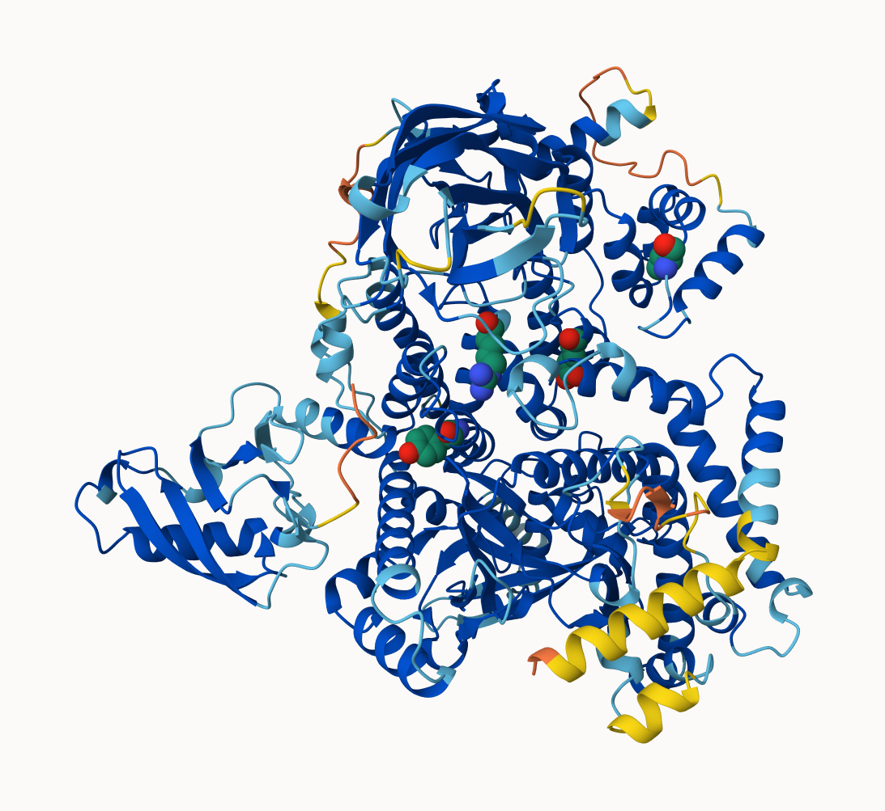

## Background 

To identify somatic mutations in a tumor, DNA from the tumor is sequenced and compared to
DNA from normal tissue in the same individual using variant calling algorithms.

## Download specific sequence

```{r}
library(bio3d)
```

```{r}
a <- read.fasta("A18125684_mutant_seq.fa")
a
```
> Q1. What protein do these sequences correspond to? (Give both full gene/protein name
and official symbol?

Using BlastP to search the refseq database I found the sequence to correspond to the phosphatidylinositol 4,5-bisphosphate 3-kinase catalytic subunit alpha isoform protein and the official symbol is PIK3CA. 


we could score residue conservation then find the non 1.0 scoring positions.  These will be the mutation positions: 

```{r}
conserv(a)
```
```{r}
mutation.sites <- which(conserv(a) < 1)
mutation.sites
```


> Q2. What are the tumor specific mutations in this particular case?

There are mutation between the tumor and wt healthy protein sequences at positions I543V , M599E, K640R, and F668Y.

> Q3.  Do your mutations cluster to any particular domain and if so give the name and
PFAM id of this domain? Alternately note whether your protein is single domain and provide
it’s PFAM id/accession and name (e.g. PF00613 and PI3Ka).

Yes all the mutations found are located in the Pfam PF00613 and PI3Ka domain Phosphoinositide 3-kinase family, which spans from amino acid position 520-703. 

> Q4. Using the NCI-GDC list the observed top 2 missense mutations in this protein
(amino acid substitutions)?

The top mutation in this protein is a missense mutation, and it is PIK3CA E545K, its found in 5.73 percent of affected cases.  The next top mutation is also a missense mutation it is, PIK3CA H1047R found in 5.23 percent of cases.

> Q5. What two TCGA projects have the most cases affected by mutations of this gene?
(Give the TCGA “code” and “Project Name” for example “TCGA-BRCA” and “Breast Invasive
Carcinoma”).

The top two mutations that ahve the most cases are TCGA-UCEC which is primarily related to Adenomas and Adenocarcinomas, and TCGA-UCS which is primarily related to Basal Cell Neoplasms and Complex Mixed and Stromal Neoplasms. 

> Q6. List one RCSB PDB identifier with 100% identity to the wt_healthy sequence
and detail the percent coverage of your query sequence for this known structure? Alternately,
provide the most similar in sequence PDB structure along with it’s percent identity, coverage
and E-value. Does this structure “cover” (i.e. include or span the amino acid residue positions)
of your previously identified tumor specific mutations?

For searching the wt_healthy sequence on the pdb database, the precent coverage is 100% and percent identity was 100% , and the e-value is 0.  It does span the amino acid residue positions of the tumor mutations since it has 100 percent query coverage and the wildtype and mutant sequences are from the same regions just differ in 4 amino acids.  The sequence ID for this structure is 4L1B_A.

> Q7. Using AlphaFold notebook generate a structural model using the default parameters
for your mutant sequence.  In this figure please clearly show your
mutant amino acid side chains as spacefill and the protein as cartoon colored by local
alpha fold pLDDT quality score.



> Q8. Considering only your mutations in high quality structure regions (with a pLDDT
score > 70) are any of the mutations on the surface of the protein and hence have a potential
to interfere with protein-protein interaction events? List these mutations below

Yes, Only one mutation is in a high quality region and on the surface of the protein and therefore could potentially be involved in protein protein interactions, and that is the mutation, I543V. 

> Q9.Please comment on how useful and/or reliable you think your AlphaFold structural
model is for your entire sequence and the main domain where your mutations lie?

All of the muations are located in the center alpha helix structure of the protein.  The AlphaFold structural model appears to be very accurate when comparing the overall structure to the PDB match found on the PDB database, the region is also estimated to be highly accurtae since it is all colored blue by the pLDDT Confidence coloring, indicating high confidence levels for this region of the predicted structure. 
> Q10. Use FTMap to find binding hotspots, Are any of the identified “hot spots” near your cancer specific mutation sites or the most
commonly mutated sites from the NCI-GDC? If so which mutation site(s)?

Yes, there appears to be 3 hotspots near K640R, and 2 M599E, based on the FTMap results. 


