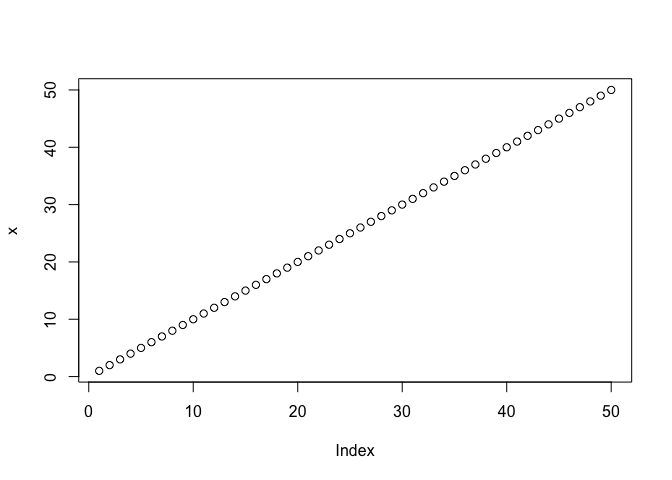
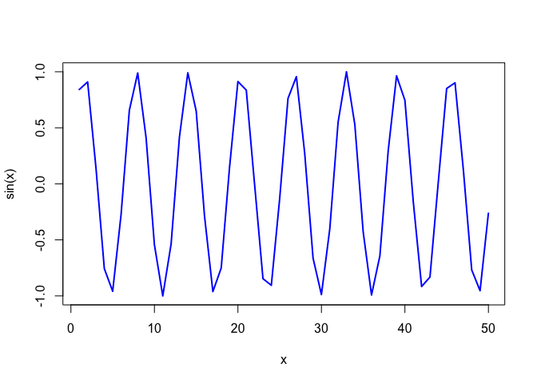

# Class 4 R Intro
Kaliyah Adei-Manu

## Making basic plots in R

``` r
x <- 1:50
plot (x)
```



Make a Sin Plot

``` r
plot (x, sin(x))
```


Let’s make it nicer:

``` r
plot (x, sin(x), typ="l", col="blue", lwd=2)
```



``` r
log(10, base =10)
```

    [1] 1
